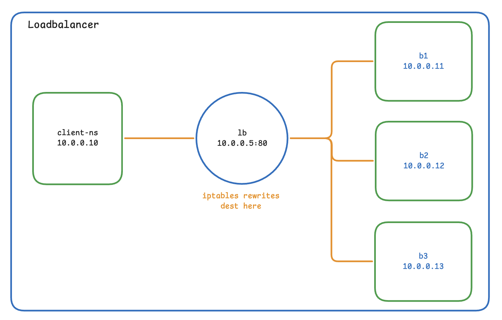
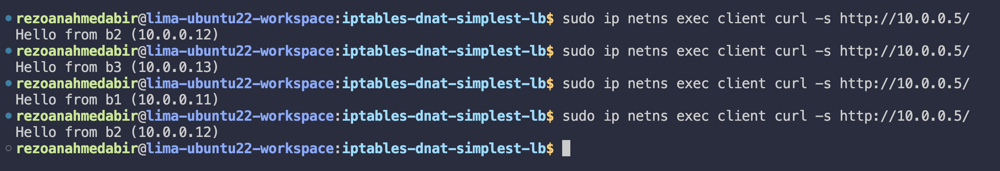
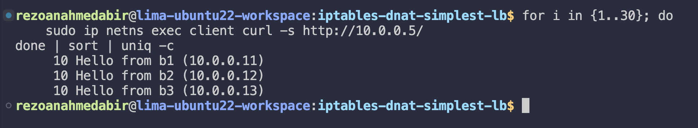
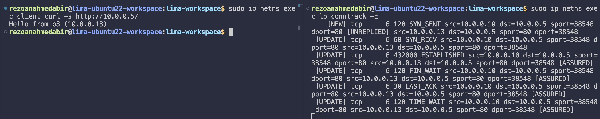

# iptables - DNAT [Simplest LoadBalancer]

## From previous

You should already have topology working from the Phase-1. Make sure:

```bash
cd ~/Developer/lima-workspace/loadbalancer-poc/network-namespaces-mental-model
sudo ./bring-up.sh
sudo ./launch-servers.sh

# Quick sanity check
sudo ip netns exec client curl -s http://10.0.0.11/
sudo ip netns exec client curl -s http://10.0.0.12/
sudo ip netns exec client curl -s http://10.0.0.13/
```

Three different "Hello from bN" responses. Good. Leave it running.

---

## What we're building

The simplest possible L4 load balancer, no userspace process, no daemon. Just iptables rules inside the `lb` network namespace that **rewrite packet destinations** before they reach the backends.



---

## Setup

Install required packages:

```bash
sudo apt install -y iptables ipvsadm nftables conntrack
```

Create the scripts directory:

```bash
cd ~/Developer/lima-workspace/loadbalancer-poc
mkdir -p ./iptables-dnat-simplest-lb
cd ./iptables-dnat-simplest-lb
```

---

## Script: `lb-iptables.sh`

```bash
#!/bin/bash
# iptables DNAT-based load balancer.

set -e

LB_NS="lb"
VIP="10.0.0.5"
VPORT="80"

BACKENDS=(
    "10.0.0.11"
    "10.0.0.12"
    "10.0.0.13"
)

echo "[+] Configuring iptables DNAT in $LB_NS"

# 1. Enable IP forwarding inside the lb netns
sudo ip netns exec "$LB_NS" sysctl -w net.ipv4.ip_forward=1 > /dev/null

# 2. Flush any existing rules
sudo ip netns exec "$LB_NS" iptables -t nat -F
sudo ip netns exec "$LB_NS" iptables -F

# 3. Round-robin DNAT using the statistic module
N=${#BACKENDS[@]}
for i in "${!BACKENDS[@]}"; do
    BACKEND="${BACKENDS[$i]}"
    REMAINING=$((N - i))

    if [ $REMAINING -gt 1 ]; then
        sudo ip netns exec "$LB_NS" iptables -t nat -A PREROUTING \
            -p tcp --dport "$VPORT" \
            -m statistic --mode nth --every $REMAINING --packet 0 \
            -j DNAT --to-destination "$BACKEND:$VPORT"
        echo "    [rule $((i+1))/$N] 1/$REMAINING → $BACKEND"
    else
        sudo ip netns exec "$LB_NS" iptables -t nat -A PREROUTING \
            -p tcp --dport "$VPORT" \
            -j DNAT --to-destination "$BACKEND:$VPORT"
        echo "    [rule $((i+1))/$N] default → $BACKEND"
    fi
done

# 4. MASQUERADE so backends reply to the LB, not directly to the client
sudo ip netns exec "$LB_NS" iptables -t nat -A POSTROUTING \
    -p tcp --dport "$VPORT" -j MASQUERADE

echo "[✓] iptables LB ready. From client: curl http://$VIP/"
```

### How the distribution math works

Rules are chained so each backend gets exactly `1/N` of traffic:

| Rule | `--every` | Probability | Effective share |
|------|-----------|-------------|-----------------|
| b1   | 3         | 1/3         | **33%**         |
| b2   | 2         | 1/2 of remaining 2/3 | **33%** |
| b3   | catch-all | remainder   | **33%**         |

> **Important:** This is per-connection, not per-packet. Once a connection is DNAT'd to a backend, **conntrack pins all subsequent packets** to that same backend for the life of the connection. This is what makes TCP work.

### Why MASQUERADE is needed

Without it, backends see the client's real IP and reply directly, the client gets a response from an unexpected IP and drops it. MASQUERADE rewrites the source IP to the LB's IP, so backends always reply back through the LB.

```
PREROUTING  →  dst rewritten  (client → LB  becomes  client → backend)
POSTROUTING →  src rewritten  (client IP  becomes  LB IP)
```

---

## Run it

```bash
chmod +x lb-iptables.sh
./lb-iptables.sh
```

### Hit the LB manually

```bash
sudo ip netns exec client curl -s http://10.0.0.5/
```



### Hit it 30 times and check distribution

```bash
for i in {1..30}; do
    sudo ip netns exec client curl -s http://10.0.0.5/
done | sort | uniq -c
```

You should see roughly **10 hits per backend**.



---

## Watch conntrack in action

conntrack is the kernel's connection tracking table, it's what makes stateful NAT work. It remembers every active connection so reply packets get automatically un-NATted back to the original client.

**Terminal 1 — watch live connection events:**

```bash
sudo ip netns exec lb conntrack -E
```

**Terminal 2 — send a request:**

```bash
sudo ip netns exec client curl -s http://10.0.0.5/
```

You'll see the full TCP lifecycle stream past in Terminal 1:



### Reading the conntrack output

Each entry has two lines, the original direction and the reply direction:

```
[NEW]         src=10.0.0.10  dst=10.0.0.5   sport=38548  dport=80   [UNREPLIED]
              src=10.0.0.13  dst=10.0.0.5   sport=80     dport=38548
```

- **Line 1** — what the client sees (destination is still the LB VIP)
- **Line 2** — the rewritten reply direction (source is the backend that was picked)

The states you'll see in order:

| State | Meaning |
|---|---|
| `[NEW] SYN_SENT` | Client sent SYN, conntrack creates entry |
| `SYN_RECV` | Backend replied with SYN-ACK, handshake in progress |
| `ESTABLISHED` | 3-way handshake complete, data flowing |
| `FIN_WAIT` | Client started closing |
| `LAST_ACK` | Backend sent its FIN, waiting for final ACK |
| `TIME_WAIT` | Fully closed, entry held 120s for late packets |

---

## Tear down

```bash
sudo ./bring-down.sh
```

Or manually flush the rules:

```bash
sudo ip netns exec lb iptables -t nat -F
sudo ip netns exec lb iptables -F
```