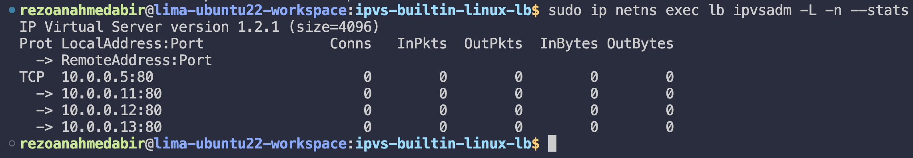
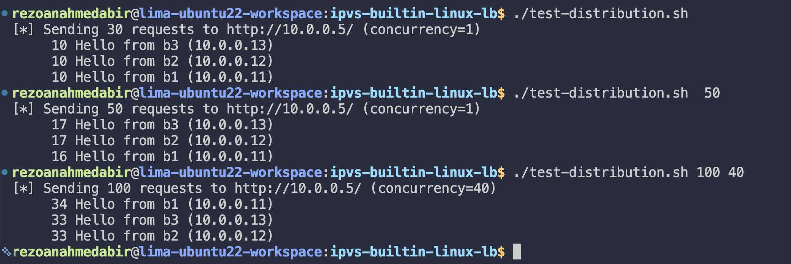
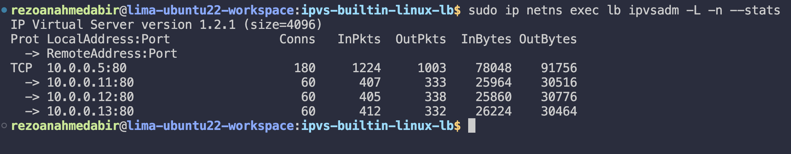
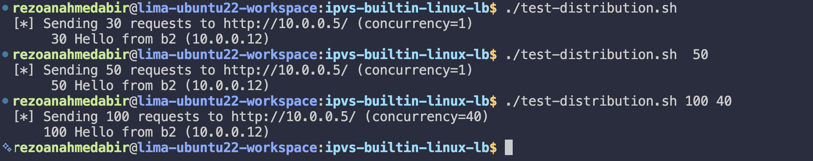
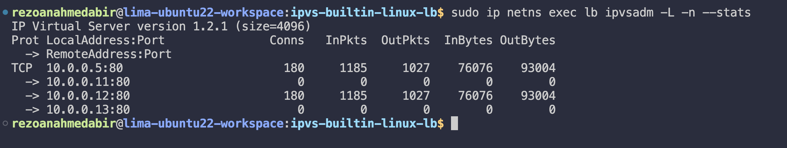

# IPVS — Built-in Linux L4 Load Balancer

## From previous

You should already have the Phase 1 topology running and Phase 2 (iptables DNAT) completed. Make sure:

```bash
cd ~/Developer/lima-workspace/loadbalancer-poc/network-namespaces-mental-model
sudo ./bring-up.sh
sudo ./launch-servers.sh

# Quick sanity check
sudo ip netns exec client curl -s http://10.0.0.11/
sudo ip netns exec client curl -s http://10.0.0.12/
sudo ip netns exec client curl -s http://10.0.0.13/
```

Three different "Hello from bN" responses. Good. Leave it running.

---

## What is IPVS

IPVS (IP Virtual Server) is a **kernel-level L4 load balancer**, not a userspace process, not iptables rules, but a dedicated kernel module built specifically for load balancing. keepalived uses it under the hood for its LB functionality. Kubernetes `kube-proxy` uses it in IPVS mode instead of iptables.

Compared to the iptables DNAT approach from Phase 2.1:

| | iptables DNAT | IPVS |
|---|---|---|
| Where | Netfilter hooks | Dedicated kernel module |
| Speed | Slower at scale | Much faster -> O(1) lookups |
| Scheduling | statistic module hack | Native: rr, wrr, lc, sh, dh, and more |
| Connection tracking | via conntrack | Built-in, per-backend stats |
| Observability | `conntrack -L` | `ipvsadm -L --stats` |

---

## Setup

Install required packages if not already done:

```bash
sudo apt install -y ipvsadm conntrack
```

Navigate to the scripts directory:

```bash
cd ~/Developer/lima-workspace/loadbalancer-poc/ipvs-builtin-linux-lb
```

---

## Script: `lb-ipvs.sh`

```bash
#!/bin/bash
# IPVS-based load balancer with NAT mode.

set -e

LB_NS="lb"
VIP="10.0.0.5"
VPORT="80"
SCHEDULER="${1:-rr}"     # rr, wrr, lc, sh, dh — pass as arg

BACKENDS=(
    "10.0.0.11"
    "10.0.0.12"
    "10.0.0.13"
)

echo "[+] Configuring IPVS in $LB_NS (scheduler: $SCHEDULER)"

# Enable IP forwarding inside the lb netns
sudo ip netns exec "$LB_NS" sysctl -w net.ipv4.ip_forward=1 > /dev/null

# NAT mode requires conntrack so MASQUERADE works on the reply path
sudo ip netns exec "$LB_NS" sysctl -w net.ipv4.vs.conntrack=1 > /dev/null 2>&1 || true

# Enable masquerading so backends reply to the LB, not directly to the client
sudo ip netns exec "$LB_NS" iptables -t nat -A POSTROUTING -j MASQUERADE

# Wipe any existing IPVS config
sudo ip netns exec "$LB_NS" ipvsadm -C

# Create the virtual service
sudo ip netns exec "$LB_NS" ipvsadm -A -t "$VIP:$VPORT" -s "$SCHEDULER"

# Add each backend as a real server in NAT mode (-m)
for BACKEND in "${BACKENDS[@]}"; do
    sudo ip netns exec "$LB_NS" ipvsadm -a -t "$VIP:$VPORT" -r "$BACKEND:$VPORT" -m
    echo "    added backend $BACKEND"
done

echo "[✓] IPVS LB ready. From client: curl http://$VIP/"
echo "    Show state: sudo ip netns exec lb ipvsadm -L -n"
```

> **Note on `vs.conntrack`:** NAT mode (`-m`) requires conntrack enabled so the MASQUERADE rule in POSTROUTING sees the reply packets and rewrites the source IP back. Without it, the curl hangs, the backend replies but the client never gets the response.

---

## Run it

```bash
chmod +x lb-ipvs.sh

# Default: round-robin
./lb-ipvs.sh rr
```

Check the virtual service is configured:

```bash
sudo ip netns exec lb ipvsadm -L -n
```



---

## Test: Round-Robin (`rr`)

```bash
./lb-ipvs.sh rr
./test-distribution.sh
./test-distribution.sh 50
./test-distribution.sh 100 40
```

For the first run, you should see roughly **10 hits per backend**.



Check per-backend packet and byte counts:

```bash
sudo ip netns exec lb ipvsadm -L -n --stats
```



The `--stats` output shows packets and bytes routed per backend, this is the observability your XDP program will eventually expose via per-CPU BPF maps.

---

## Test: Source Hashing (`sh`)

Source hashing routes **same source IP → same backend**, deterministically. No flow table needed, the backend is computed from the source IP every time.

```bash
./lb-ipvs.sh sh
./test-distribution.sh
./test-distribution.sh 50
./test-distribution.sh 100 40
```

All requests from `client` (same source IP `10.0.0.10`) should hit **one backend only**.




 
---

## All Supported Schedulers

```bash
./lb-ipvs.sh rr     # round-robin — equal distribution
./lb-ipvs.sh wrr    # weighted round-robin — send more to heavier backends
./lb-ipvs.sh lc     # least connections — always pick the least busy backend
./lb-ipvs.sh sh     # source hash — same client IP → same backend
./lb-ipvs.sh dh     # destination hash — same dst IP → same backend
```

---

## Test Harness: `test-distribution.sh`

Reusable script for consistent testing across all phases.

```bash
#!/bin/bash
# Send N requests from client to VIP and report the distribution.

set -e

VIP="10.0.0.5"
N="${1:-30}"
CONCURRENCY="${2:-1}"

echo "[*] Sending $N requests to http://$VIP/ (concurrency=$CONCURRENCY)"

if [ "$CONCURRENCY" -eq 1 ]; then
    for i in $(seq 1 "$N"); do
        sudo ip netns exec client curl -s --max-time 2 "http://$VIP/" || echo "FAIL"
    done | sort | uniq -c | sort -rn
else
    seq 1 "$N" | xargs -P "$CONCURRENCY" -I{} sudo ip netns exec client \
        curl -s --max-time 2 "http://$VIP/" | sort | uniq -c | sort -rn
fi
```

Usage:

```bash
# 30 sequential requests
./test-distribution.sh 30

# 100 requests, 10 concurrent
./test-distribution.sh 100 10
```

---

## Tear Down

```bash
sudo ./bring-down.sh
```

Or manually:

```bash
sudo ip netns exec lb ipvsadm -C
sudo ip netns exec lb iptables -t nat -F
```

---
