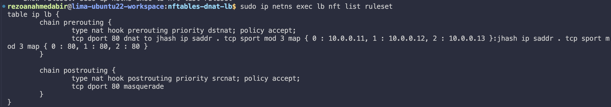
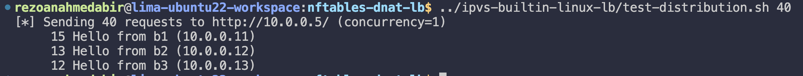

# nftables — DNAT Load Balancer with jhash

## From previous

You should already have the Phase 1 topology running. Make sure:

```bash
cd ~/Developer/lima-workspace/loadbalancer-poc/network-namespaces-mental-model
sudo ./bring-up.sh
sudo ./launch-servers.sh

# Quick sanity check
sudo ip netns exec client curl -s http://10.0.0.11/
sudo ip netns exec client curl -s http://10.0.0.12/
sudo ip netns exec client curl -s http://10.0.0.13/
```

Three different "Hello from bN" responses. Good. Leave it running.

---

## What is nftables

**nftables** is the modern replacement for iptables, same kernel netfilter hooks, but a cleaner syntax, better performance, and native support for sets, maps, and concat types. It ships as the default firewall tool on Ubuntu 20.04+.

Compared to the previous phases:

| | iptables DNAT | IPVS | nftables |
|---|---|---|---|
| Backend selection | statistic module (per-N) | kernel scheduler | jhash (per flow) |
| Connection stickiness | conntrack | built-in | jhash is deterministic |
| Maps / sets | no | no | native |
| Syntax | verbose, one rule per thing | separate tool (`ipvsadm`) | compact, declarative |
| Observability | `iptables -L` | `ipvsadm -L --stats` | `nft list ruleset` |

---

## How jhash works here

Instead of the `statistic --mode nth` trick from iptables or a kernel scheduler from IPVS, nftables uses `jhash` — a fast hash function applied to the **source IP + source port** of every new connection:

```
jhash ip saddr . tcp sport mod N
```

- Hashes the 5-tuple (effectively `saddr:sport`) into a number
- Takes `mod N` to get an index `0..N-1`
- Maps the index to a backend

This gives **connection stickiness without conntrack**, the same client IP + port always hashes to the same backend deterministically. No state table needed.

---

## The two-map trick

nftables can't parse `10.0.0.11:80` as a single map value because the `:` is ambiguous. The fix is to split into two separate maps and let nftables concatenate them:

```
dnat to
    jhash ip saddr . tcp sport mod N map { 0:10.0.0.11, ... }   ← resolves to IP
    :
    jhash ip saddr . tcp sport mod N map { 0:80, ... }           ← resolves to port
```

The `:` between the two expressions is nftables' concat operator for `dnat to <ip> : <port>`. Each map returns a simple scalar — no type ambiguity, no parser errors.

This is also more efficient than the per-rule approach, one kernel rule with O(1) map lookups instead of N rules evaluated linearly.

---

## Script: `lb-nftables.sh`

```bash
#!/bin/bash
# nftables DNAT-based load balancer using jhash for stable backend selection.

set -e

LB_NS="lb"
VIP="10.0.0.5"
VPORT="80"

BACKENDS=("10.0.0.11" "10.0.0.12" "10.0.0.13")

echo "[+] Configuring nftables in $LB_NS"

sudo ip netns exec "$LB_NS" sysctl -w net.ipv4.ip_forward=1 > /dev/null

sudo ip netns exec "$LB_NS" nft flush ruleset

N=${#BACKENDS[@]}

# Build two separate maps — one for IP, one for port
IP_MAP=""
PORT_MAP=""
for i in "${!BACKENDS[@]}"; do
    [ -n "$IP_MAP" ] && IP_MAP+=", "
    [ -n "$PORT_MAP" ] && PORT_MAP+=", "
    IP_MAP+="$i : ${BACKENDS[$i]}"
    PORT_MAP+="$i : $VPORT"
done

sudo ip netns exec "$LB_NS" nft -f - <<EOF
table ip lb {
    chain prerouting {
        type nat hook prerouting priority dstnat; policy accept;
        tcp dport $VPORT dnat to \
            jhash ip saddr . tcp sport mod $N map { $IP_MAP } \
            : \
            jhash ip saddr . tcp sport mod $N map { $PORT_MAP }
    }

    chain postrouting {
        type nat hook postrouting priority srcnat; policy accept;
        tcp dport $VPORT masquerade
    }
}
EOF

echo "[✓] nftables LB ready"
echo "    Show ruleset: sudo ip netns exec lb nft list ruleset"
```

---

## Run it

```bash
chmod +x lb-nftables.sh
./lb-nftables.sh
```

Verify the ruleset loaded correctly:

```bash
sudo ip netns exec lb nft list ruleset
```



---

## Test distribution

```bash
for i in {1..40}; do
    sudo ip netns exec client curl -s http://10.0.0.5/
done | sort | uniq -c
```

You should see roughly equal distribution across all three backends.



Or use the shared test harness from Phase 3:

```bash
./test-distribution.sh 40
```

---

## Tear down

```bash
sudo ./bring-down.sh
```

Or manually:

```bash
sudo ip netns exec lb nft flush ruleset
```

---

