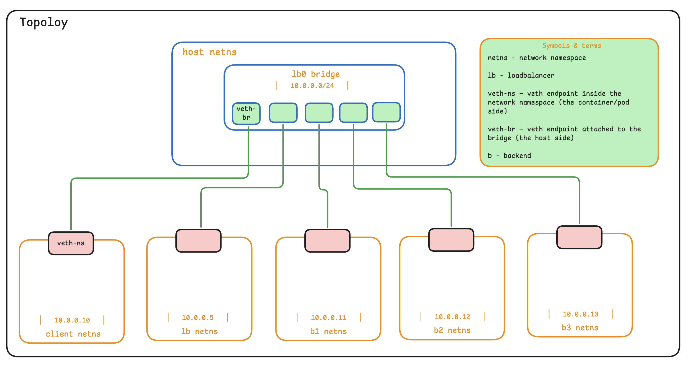
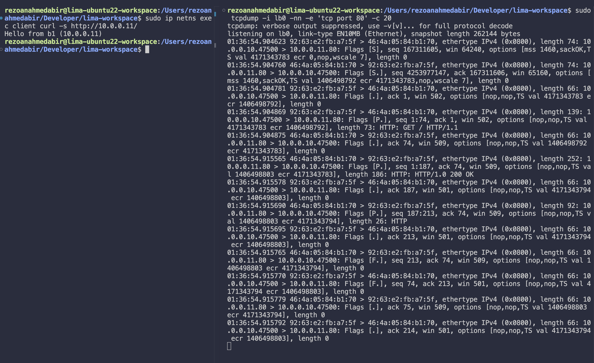

# Network Namespaces Mental Model

This phase builds the network topology that the load balancer will eventually run on, using only Linux primitives, no containers, no Docker, no eBPF yet. The goal is to understand what packets are doing on the wire before introducing XDP into the picture.

## Topology

Five network namespaces (`client`, `lb`, `b1`, `b2`, `b3`) are connected to a single Linux bridge. Each namespace gets one end of a veth pair; the other end plugs into the bridge.



The bridge IP (`10.0.0.1`) is derived dynamically from the configured subnet, so changing the subnet in one place rewires everything.

## Phase layout

```
network-namespaces-mental-model/
├── topology.sh          # shared definitions (subnet, nodes); sourced by others
├── bring-up.sh          # builds the namespaces, veths, bridge
├── bring-down.sh        # tears it all down
├── launch-servers.sh    # starts a labeled HTTP server in each backend netns
└── kill-servers.sh      # stops the HTTP servers

```

## Prerequisites

A Linux host (or VM) with:

- `iproute2` (`ip`, `bridge`)
- `iputils-ping`
- `tcpdump`
- `python3` (for the test HTTP servers)
- `sudo` / root access (creating namespaces and bridges is privileged)

Verify quickly:

```bash
ip -V && tcpdump --version && python3 --version
```

## Quick start

```bash
cd loadbalancer-poc/network-namespaces-mental-model
chmod +x *.sh

# 1. Bring the topology up
sudo ./bring-up.sh

# 2. Start an HTTP server in each backend
sudo ./launch-servers.sh

# 3. From the client namespace, hit each backend directly
sudo ip netns exec client curl -s http://10.0.0.11/
sudo ip netns exec client curl -s http://10.0.0.12/
sudo ip netns exec client curl -s http://10.0.0.13/

# 4. Tear down when done
sudo ./kill-servers.sh
sudo ./bring-down.sh
```

Each `curl` should return a different `Hello from bN` string, confirming end-to-end L2 connectivity through the bridge.

## How it works

### `topology.sh` — single source of truth

Defines the subnet and the list of nodes. Sourced by every other script so the topology lives in one place. The bridge IP is computed from the subnet:

```bash
NETWORK="${SUBNET%%/*}"          # strip CIDR suffix → "10.0.0.0"
BRIDGE_IP="${NETWORK%.*}.1"      # replace last octet → "10.0.0.1"
```

Change the subnet, and the bridge IP and node IPs follow.

### `bring-up.sh` — what each step does

For each node in the topology, the script:

1. **Creates the namespace** (`ip netns add`).
2. **Creates a veth pair** — two virtual interfaces wired back-to-back. Anything sent on one end comes out the other.
3. **Plugs the "bridge end"** of the pair into the bridge (`ip link set ... master`).
4. **Moves the "namespace end"** into the netns (`ip link set ... netns`).
5. **Configures the interface inside the netns**: brings up `lo`, assigns the IP, brings up the veth.
6. **Adds a default route** inside the netns pointing at the bridge IP.

The bridge itself gets the `.1` address of the subnet so the host can reach the namespaces directly (useful for debugging) and so each namespace has a sensible default gateway.

### `bring-down.sh`

Deleting a namespace automatically destroys any veth that had one end inside it, so cleanup is just: delete each namespace, delete the bridge. The script is idempotent — running it when nothing is up is a no-op rather than an error.

### `launch-servers.sh` / `kill-servers.sh`

Each backend gets a tiny static HTML page identifying itself and runs `python3 -m http.server 80` in the background. The kill script `pkill`s those servers cleanly. Useful for confirming load-balancing behavior in later phases — when the same request lands on different backends, you'll see different response bodies.

## Verifying the topology

After `bring-up.sh`, these should all succeed:

```bash
# All namespaces exist
ip netns list

# Host can reach the bridge and each namespace
ping -c 2 10.0.0.1
ping -c 2 10.0.0.11

# Client can reach lb and all backends
sudo ip netns exec client ping -c 2 10.0.0.5
sudo ip netns exec client ping -c 2 10.0.0.11
sudo ip netns exec client ping -c 2 10.0.0.12
sudo ip netns exec client ping -c 2 10.0.0.13

# Inspect from inside a namespace
sudo ip netns exec client ip addr
sudo ip netns exec client ip route

# See which veths are attached to the bridge
bridge link show
```

## Watching packets

In one terminal, capture traffic on the bridge:

```bash
sudo tcpdump -i lb0 -nn -e 'tcp port 80' -c 20
```

In another, generate traffic:

```bash
sudo ip netns exec client curl -s http://10.0.0.11/
```

You should see the full TCP handshake (SYN → SYN-ACK → ACK), the HTTP GET, the response, and the connection teardown. The `-e` flag shows MAC addresses, which matters later, XDP will be rewriting them.

> **Sample capture :**
>
> 

## Troubleshooting

| Symptom | Likely cause | Fix |
|---|---|---|
| `RTNETLINK answers: Operation not permitted` | Not running as root | Use `sudo` |
| Ping from host to namespace times out | `net.ipv4.ip_forward` disabled | `sudo sysctl -w net.ipv4.ip_forward=1` |
| `bridge: command not found` | `iproute2` missing or old | `sudo apt install iproute2` |
| `RTNETLINK answers: File exists` on `bring-up.sh` | A previous run wasn't cleaned up | `sudo ./bring-down.sh` then retry |
| ARP failures across the bridge | Stale neighbor entries | `sudo ip netns exec <ns> ip neigh flush all` |

## What this phase deliberately does NOT do

- No load balancing logic. Traffic goes wherever you direct it manually.
- No XDP or eBPF. The bridge handles forwarding using normal kernel paths.
- No containers. Namespaces are the bare primitive; containers add filesystem, cgroup, and process isolation on top.
- No VIP, no DNAT, no flow tracking. Those come in later phases.

This phase is the foundation. Every subsequent phase replaces *one* part of this setup with a more sophisticated mechanism, while everything else stays the same, which makes it easy to see exactly what each new piece is doing.
