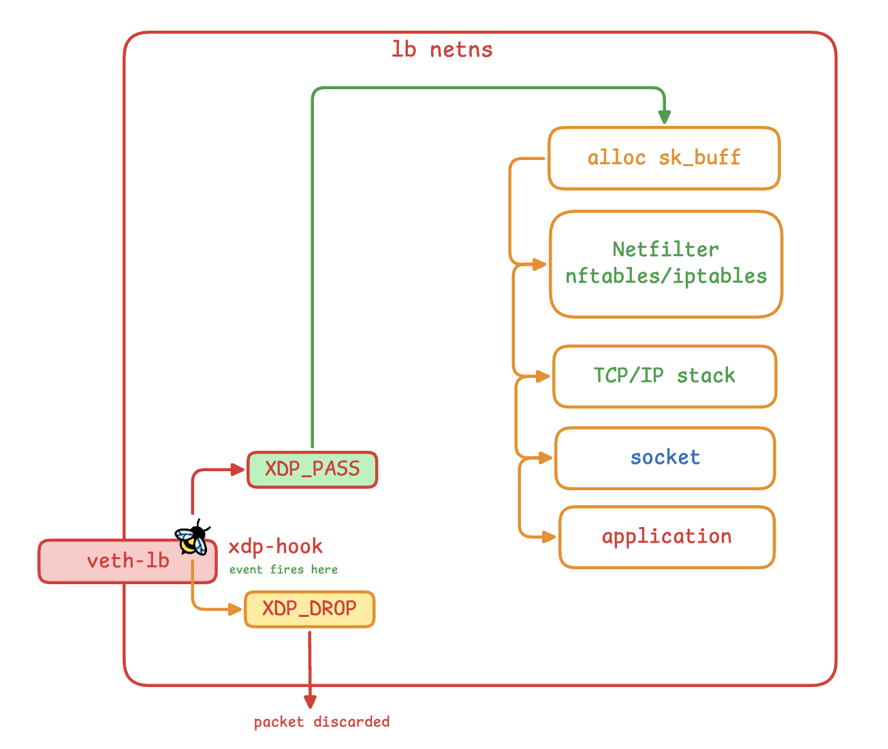
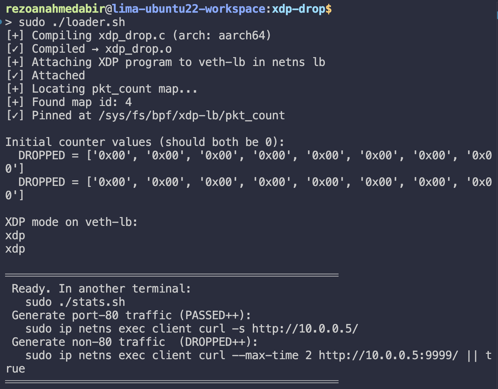
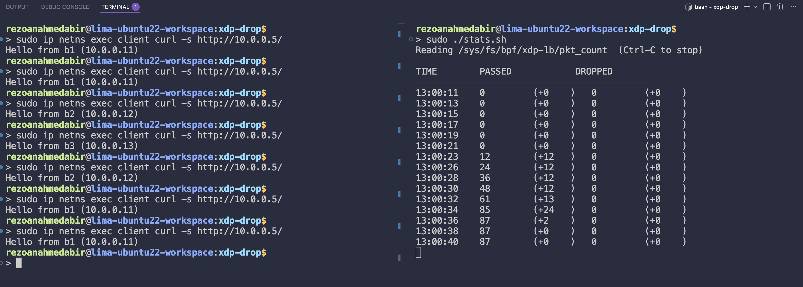
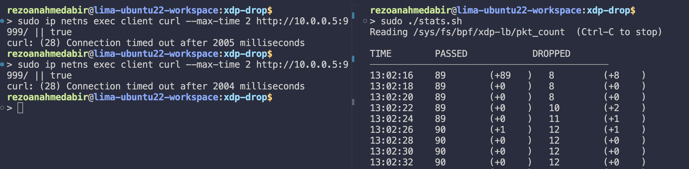

# XDP Drop

> Attach a BPF/XDP program that actively drops unwanted packets at the NIC driver level, and share packet counters between the kernel program and userspace — all without touching netfilter.

---

## What this phase introduces

Phase 05 was a pure observer: it read packets and printed trace lines, but never acted on them. Phase 06 introduces two new capabilities that together form the foundation of everything that follows.

**`XDP_DROP`** — the first time we act on a packet instead of just watching it. A packet returned with `XDP_DROP` is freed immediately inside the NIC driver. No socket buffer (`sk_buff`) is allocated. No netfilter rule fires. No conntrack entry is created. The packet simply ceases to exist from the kernel's perspective. This is the lowest-cost way to discard traffic on Linux.

**BPF maps** — the first time the kernel program and userspace share persistent state. The XDP program writes packet counts into a map after every verdict; `stats.sh` reads those counts from userspace on a two-second poll loop. Maps are the only mechanism for durable state in BPF — the XDP stack frame is destroyed after every return, so any local variable is gone the moment the program exits.

The program is still transparent to the existing nftables / IPVS load balancer from phases 02–04. `XDP_PASS` hands port-80 traffic onward to netfilter unchanged, so you can run this filter and a previous LB phase simultaneously.

---

## Fundamentals

### Where XDP sits in the kernel receive path



`XDP_DROP` exits this pipeline at the very first box. Nothing below it runs. This is why XDP drop is used for DDoS mitigation, a 10 Mpps flood can be discarded before the kernel allocates a single byte of socket buffer.

### BPF maps —> kernel ↔ userspace shared memory

A BPF map is a kernel-managed data structure with two access points:

- **From the BPF program (kernel side):** via helper functions like `bpf_map_lookup_elem`, `bpf_map_update_elem`.
- **From userspace:** via file descriptors, `bpftool`, or the `bpf()` syscall directly.

Maps are the **only** way for a BPF program to communicate persistent state. You cannot use global C variables — the BPF stack frame is torn down after every packet return, so any local state is lost. Maps live in kernel memory and persist independently of the program's execution lifetime.

### Map types used in this phase

| Type | Key | Value | Use case |
|------|-----|-------|----------|
| `BPF_MAP_TYPE_ARRAY` | `__u32` index | any | Fixed number of named slots, pre-zeroed, O(1) lookup |
| `BPF_MAP_TYPE_HASH` | arbitrary | any | Dynamic key space (used in phase 08 for 4-tuple flow tables) |
| `BPF_MAP_TYPE_PERCPU_ARRAY` | `__u32` index | per-CPU copy | Eliminates atomic contention (introduced in phase 09) |

This phase uses `BPF_MAP_TYPE_ARRAY` with two slots: index 0 for `PASSED`, index 1 for `DROPPED`. An ARRAY is the right choice here because the key space is fixed (exactly two counters), values are pre-zeroed at creation, and lookup is a direct index with no hashing overhead.

### Map pinning — keeping a map alive after the loader exits

By default, a BPF map is reference-counted. When the last file descriptor holding a reference closes, the kernel garbage-collects it. If the loader process exits, the map disappears and all accumulated counter data is lost.

**Pinning** creates a named reference in the BPF virtual filesystem (`/sys/fs/bpf/`) that keeps the map alive independently of any process. `stats.sh` can then open the map by path, read it, and close it — all without needing to be the same process that created it. Pinning is what makes it possible to restart the loader without losing counter history.

```
/sys/fs/bpf/xdp-lb/pkt_count   ← pinned reference (survives loader exit)
```

### Why `__sync_fetch_and_add` and not `(*val)++`

XDP programs run on every CPU simultaneously. Two CPUs processing two different packets can both execute the counter increment at the same instant:

```
CPU 0: read val = 42
CPU 1: read val = 42        ← reads the same value
CPU 0: write val = 43
CPU 1: write val = 43       ← overwrites CPU 0's write — one increment lost
```

`__sync_fetch_and_add(val, 1)` is a GCC/Clang atomic built-in. The BPF JIT compiles it to a single `LOCK XADD` instruction on x86, which the CPU executes indivisibly. The hardware bus lock prevents the race.

This is correct but has a cost: the bus lock stalls other CPUs momentarily. Phase 09 eliminates this by using `BPF_MAP_TYPE_PERCPU_ARRAY`, which gives each CPU its own counter copy. Userspace then sums the per-CPU values when reading. We use `ARRAY + atomic add` here intentionally — to see the contention problem first, then understand why PERCPU solves it.

### The BPF verifier and the mandatory NULL check

After `bpf_map_lookup_elem()`, the verifier marks the return value as `map_value_or_null`. It does this even for an ARRAY map with a known-valid index — the verifier is conservative and does not track index range at compile time. If you dereference the pointer without checking for NULL first, the verifier rejects the program with:

```
R0 invalid mem access 'map_value_or_null'
```

The NULL check is not defensive — an ARRAY lookup for index 0 or 1 can never return NULL at runtime. The check is **load-bearing**: it exists to satisfy the verifier's static analysis, not to handle a runtime condition.

---

## Files

```
xdp-drop/
├── xdp_drop.c       ← BPF kernel program (compiled to BPF bytecode)
├── loader.sh        ← compile + attach + pin map
├── stats.sh         ← read and display counters (run in a second terminal)
├── bring-down.sh    ← detach + unpin + cleanup
└── debug.sh         ← step-by-step diagnostic when counters show 0
```

---

## Quick start

```bash
# 1. Topology and servers must be running
cd ../network-namespaces-mental-model
sudo ./bring-up.sh && sudo ./launch-servers.sh

# 2. Start a previous LB phase so port-80 traffic gets forwarded
cd ../nftables-dnat-lb && sudo ./lb-nftables.sh

# 3. Attach the XDP drop filter
cd ../xdp-drop
sudo ./loader.sh

# 4. In a second terminal — watch counters update live
sudo ./stats.sh

# 5. In a third terminal — generate traffic

# Port 80 — passes XDP, reaches nftables, gets a response (PASSED++)
sudo ip netns exec client curl -s http://10.0.0.5/

# Non-port-80 — dropped by XDP before kernel stack (DROPPED++)
sudo ip netns exec client curl --max-time 2 http://10.0.0.5:9999/ || true

# 6. Tear down
sudo ./bring-down.sh
```

Outputs for different executions

**Loader Output**



**Running Stats while packet goes to port 80**


**Running Stats while packet goes to port !80**


---

## Architecture

```
veth-lb receives two classes of TCP traffic:

  Forward path  (client → lb):   tcph->dest   = 80
  Return path   (backend → lb):  tcph->source = 80

  DROP condition: packet is port-80 in NEITHER direction.
  PASS condition: packet involves port 80 in at least one direction.

This correctly passes both client requests and backend replies,
while dropping everything else (port scans, wrong-port probes).
```

### Why __always_inline?

BPF does not support function calls in the traditional sense, the verifier tracks register state through calls and the call stack is limited to 8 frames with `512-byte` stack each.  `__always_inline` forces the compiler to
inline the body at each call site, eliminating the call overhead and the stack frame.  For small helpers this is the standard BPF pattern. (BPF-to-BPF calls are supported since kernel 4.16 but inlining is still
preferred for hot-path helpers to avoid stack pressure.)

### Why check both `tcph->dest` and `tcph->source`

`veth-lb` is a junction. It receives traffic from two directions simultaneously:

```
Direction A — client → lb (request):
    tcph->dest   = 80          targeting our VIP port
    tcph->source = 54321       client's ephemeral port

Direction B — backend → lb (reply):
    tcph->source = 80          backend replying from its server port
    tcph->dest   = 54321       the client's original source port
```

A filter that only checks `tcph->dest == 80` passes direction A correctly but drops every backend reply — because a reply has `tcph->dest = 54321`, not 80. The connection appears to work (the SYN passes) but no response ever arrives. The client hangs.

The correct policy drops a packet only if port 80 appears in **neither** direction:

```c
if (tcph->dest != bpf_htons(80) && tcph->source != bpf_htons(80)) {
    count(IDX_DROP);
    return XDP_DROP;
}
```

This is the most important insight of this phase. It generalises beyond XDP: any filter on a load balancer interface must handle bidirectional traffic, or it will silently break the return path. The same mistake appears in production as iptables INPUT rules that allow inbound port 80 but forget to allow `ESTABLISHED,RELATED` return traffic, and as security groups that pass requests but drop replies.

### Why not filter by IP address instead

Checking `iph->saddr` against known backend IPs (10.0.0.11, 10.0.0.12, 10.0.0.13) would also distinguish directions. But it requires:
- A BPF map containing all backend IPs
- A `bpf_map_lookup_elem` call on every packet's hot path
- A program reload whenever backends are added or removed

The port check is O(1), stateless, and correct for a topology where only backends serve on port 80. Phase 08 introduces proper per-flow tracking with a 4-tuple connection table for cases where this assumption does not hold.

### Why non-TCP and non-IPv4 traffic is always passed

ARP must flow or the namespaces lose MAC resolution and all connectivity breaks. ICMP must flow for `ping`-based debugging. Non-TCP protocols are unconditionally `XDP_PASS`ed with their own counter increment.

---

## The `pkt_count` map

```c
struct {
    __uint(type, BPF_MAP_TYPE_ARRAY);
    __uint(max_entries, 2);
    __type(key, __u32);
    __type(value, __u64);
} pkt_count SEC(".maps");

#define IDX_PASS  0   slot 0 = packets passed
#define IDX_DROP  1   slot 1 = packets dropped
```

**Why `__u64` for the counter value.** A `__u32` counter wraps at ~4 billion packets. At a modest 1 Mpps, that is 71 minutes. `__u64` wraps in approximately 584,000 years. Packet counters should always be 64-bit.

**Why a single ARRAY with two slots instead of two separate maps.** Fewer map file descriptors to manage in userspace, one object to pin, and logically both counters are the same kind of thing (packet verdict counts). A HASH map would be overkill for two fixed-index slots.

---

## What changes between phase 05 and phase 06

| | Phase 05 | Phase 06 |
|---|---|---|
| Return codes used | `XDP_PASS`, `XDP_ABORTED` | `XDP_PASS`, `XDP_DROP`, `XDP_ABORTED` |
| Packet modification | None | None |
| State | None | `pkt_count` map: two 64-bit counters |
| Userspace I/O | `bpf_printk` → trace_pipe | `bpftool map dump` → counters |
| Map type | None | `BPF_MAP_TYPE_ARRAY` |

---

## Engineering case study — every problem encountered and how it was fixed

This section documents every failure that occurred during implementation, the exact diagnostic that found it, the root cause, and the fix applied. The goal is not just to record what broke — it is to show the reasoning chain from symptom to cause.

---

### Problem 1 — Counters always show 0

**Symptom.** The loader attached successfully and `stats.sh` ran, but every line showed `PASSED=0 DROPPED=0` regardless of how much curl traffic was generated.

**First diagnostic step.** Running `debug.sh` revealed at step 7 (manual map write + read):

```json
[{"formatted":{"key":0,"value":1001}},{"formatted":{"key":1,"value":3}}]
```

The counters were incrementing. The XDP program was writing to the map correctly. The problem was in how `stats.sh` was reading them.

**Root cause.** The original `stats.sh`,from analysis prev versions we thought **bpftool** emits text-format output:

```
key: 00 00 00 00  value: 42 00 00 00 00 00 00 00
```

And parsed it with:
```bash
PASS_HEX=$(echo "$DUMP" \
    | awk '/key: 00 00 00 00/{getline; print}' \
    | grep -oP 'value: \K.*' | tr -d ' ')
```

But on kernels where BTF (BPF Type Format) is active, visible as `btf_id N` in `bpftool map list` output — bpftool emits `JSON` by default:

```json
[{"key":["0x00","0x00","0x00","0x00"],
  "value":["0xe7","0x03","0x00","0x00","0x00","0x00","0x00","0x00"],
  "formatted":{"key":0,"value":999}}]
```

The awk/grep chain matched nothing against JSON. `PASS_HEX` was empty. `$(( 16# ))` evaluated to 0. The counters appeared frozen at zero while the kernel was updating them correctly all along.

There was also a secondary bug: the hex-to-decimal conversion (`fold -w2 | tac | tr -d '\n'`) was fragile — it failed silently on systems where `tac` is not in PATH.

**Fix.** Switch the reader to `bpftool map dump --json` and parse `formatted.value`, which bpftool already decoded from little-endian bytes into a plain integer:

```python
entries = json.load(sys.stdin)
counts = {}
for e in entries:
    if 'formatted' in e:
        k = e['formatted']['key']
        v = e['formatted']['value']
    else:
        k = e['key']   # fallback for older bpftool without BTF
        v = e['value']
    counts[k] = v
print(counts.get(0, 0), counts.get(1, 0))
```

**Lesson.** `bpftool` output format is not stable across kernel versions. When BTF is present, bpftool emits structured JSON with pre-decoded values in the `formatted` field. Always use `--json` and read `formatted.value` — it has already done the little-endian decoding for you. Never parse bpftool text output with awk/grep in scripts intended to run on multiple kernels.

---

### Problem 2 — Map pin fails silently

**Symptom.** `loader.sh` ran without any error, printed `[✓] Attached`, but `stats.sh` reported "Map not found at `/sys/fs/bpf/xdp-lb/pkt_count`".

**Root cause.** The map ID extraction used:

```bash
MAP_ID=$(sudo bpftool map list 2>/dev/null \
    | grep '"pkt_count"' \
    | grep -oP '^\K[0-9]+' \
    | tail -1)
```

The pattern `'"pkt_count"'` expected the name to be quoted. But bpftool text mode outputs:

```
11: array  name pkt_count  flags 0x0
```

No quotes. The grep matched nothing. `MAP_ID` was empty. The subsequent `bpftool map pin id "" ...` command failed silently — `set -e` was not active in that subshell — and no error was printed. The attached XDP program was writing to a live map, but that map was never pinned, so `stats.sh` could not find it.

The confusion came from looking at bpftool `--json` output (where names appear as `"pkt_count"` with quotes) and incorrectly assuming text output would match the same pattern.

**Fix.** Use `awk` to extract the first field on the line containing `name pkt_count`, then strip the trailing colon:

```bash
MAP_ID=$(sudo bpftool map list 2>/dev/null \
    | awk '/name pkt_count/ { gsub(/:/, "", $1); print $1 }' \
    | tail -1)
```

On this machine `bpftool map list` outputs:
```
11: array  name pkt_count  flags 0x0
```

`awk` on the matching line: `$1` = `"11:"`, `gsub` strips `:`, result = `"11"`. `tail -1` picks the highest ID in case stale maps from a previous run exist — the most recently created map always has the highest ID.

**Lesson.** Never grep for a quoted string in bpftool text output. Names are unquoted in text mode and quoted in JSON mode. Use `awk` with positional field extraction — the first token on any `bpftool map list` line is always `ID:`, which is format-stable across versions.

---

### Problem 3 — JSON parser reads raw byte array instead of integer

**Symptom.** After the map ID fix, the counter reader still showed 0. Direct `bpftool map dump --json` confirmed the map had data:

```json
{"key":["0x00","0x00","0x00","0x00"],
 "value":["0xe7","0x03","0x00","0x00","0x00","0x00","0x00","0x00"],
 "formatted":{"key":0,"value":999}}
```

**Root cause.** The Python parser was reading `e['value']`, which is the raw byte array `["0xe7","0x03",...]` — a list of hex strings, not an integer. Trying to do arithmetic on a list produced an exception that was silently swallowed, leaving the counter at 0.

When BTF is present, `bpftool --json` emits **two representations** of each entry:
- `"value"` — raw bytes in memory order, as a list of hex strings (little-endian)
- `"formatted"` — decoded integer values, BTF-aware pretty print

The parser was reading `"value"` (raw bytes) instead of `"formatted"."value"` (decoded integer).

**Fix.** Explicitly prefer `formatted` when present:

```python
if 'formatted' in e:
    v = e['formatted']['value']   # decoded integer — use this
else:
    v = e['value']                # raw bytes fallback for old bpftool
```

**Lesson.** When `btf_id` is visible in `bpftool map list`, bpftool knows the type schema of every map value and will always emit both `value` (raw) and `formatted` (decoded) in `--json` output. Always read `formatted` — it has already handled the little-endian byte order conversion.

---

### Problem 4 — `curl` hangs when XDP drop filter runs alongside nftables LB

**Symptom.** With nftables LB running from phase 04 and the XDP drop filter attached on top, a simple `curl http://10.0.0.5/` hung indefinitely. The `PASSED` counter incremented (the SYN was passing through) but `DROPPED` also incremented, and no response ever arrived.

**Diagnosis.** tcpdump on `lb0` while generating one curl:

```
client:54321 → lb:80    [S]       ← SYN passes XDP ✓  (tcph->dest = 80)
b1:80 → lb:54321        [S.]      ← SYN-ACK arrives at veth-lb
(silence — SYN-ACK never forwarded to client)
```

The backend's SYN-ACK arrived at `veth-lb`. XDP fired. The SYN-ACK has:
- `tcph->source = 80` (backend replies from its server port)
- `tcph->dest = 54321` (the client's ephemeral port)

The filter at the time checked only:
```c
if (tcph->dest != bpf_htons(80))
    return XDP_DROP;
```

`tcph->dest = 54321 ≠ 80` → `XDP_DROP`. The reply was silently killed. The client never received the SYN-ACK. TCP retried the SYN. The `DROPPED` counter incremented for each SYN-ACK from the backend.

**Root cause.** The filter assumed all traffic on `veth-lb` was unidirectional (client → lb). In reality `veth-lb` is bidirectional: it receives client requests (port 80 as destination) AND backend replies (port 80 as source) on the same physical interface. A filter on `tcph->dest == 80` correctly passes direction A but silently kills direction B.

This is the fundamental asymmetry of a load balancer interface: port 80 appears as the **destination** in client packets and as the **source** in backend packets.

**Fix.** Change the drop condition to only discard traffic that does not involve port 80 in either direction:

```c
BEFORE (broken — drops backend replies):
if (tcph->dest != bpf_htons(80)) {
    count(IDX_DROP);
    return XDP_DROP;
}

AFTER (correct — passes both directions):
if (tcph->dest != bpf_htons(80) && tcph->source != bpf_htons(80)) {
    count(IDX_DROP);
    return XDP_DROP;
}
```

**Lesson.** This is the most operationally significant lesson in phase 06. Any filter on a load balancer interface must handle bidirectional traffic. The same mistake appears in production as:
- iptables INPUT rules that allow inbound port 80 but forget `ESTABLISHED,RELATED` return traffic
- Security groups that pass requests but silently drop replies
- XDP filters written by developers who only tested with curl and never ran tcpdump on the backend side

The diagnostic that found it — `tcpdump on lb0` showing the SYN-ACK arriving but not leaving — is the right first step whenever a TCP connection establishes but no response arrives.

---

### Debugging summary table

| # | Problem | Root cause | Fix |
|---|---|---|---|
| 1 | Counters always 0 | `stats.sh` parsed bpftool text; bpftool emits JSON when BTF present | Use `--json` + read `formatted.value` |
| 2 | Map pin fails silently | `grep '"pkt_count"'` doesn't match unquoted text output | `awk` on field position: `$1` on line matching `name pkt_count` |
| 3 | Parser reads raw byte array | `e['value']` is a list of hex strings; `e['formatted']['value']` is the decoded integer | Read `formatted.value` when BTF is present |
| 4 | `curl` hangs with XDP + nftables | Filter only checked `tcph->dest == 80`; backend replies have `tcph->source == 80` | Drop only when NEITHER direction matches port 80 |

---

## Experiments to try

### 1. Verify drop happens before the kernel stack

Without XDP attached, send a packet to a closed port:
```bash
sudo tcpdump -i lb0 -nn tcp port 9999 &
sudo ip netns exec client bash -c 'echo "" | nc -w1 10.0.0.5 9999' || true
```
You see: `SYN → RST`. The kernel received the SYN, found no listener, and replied.

With XDP attached:
```bash
sudo ip netns exec client bash -c 'echo "" | nc -w1 10.0.0.5 9999' || true
```
You see: `SYN` on the bridge — then silence. No RST. The packet was freed before the kernel ever processed it. `DROPPED` counter increments by 1.

### 2. Break the verifier intentionally

In `xdp_drop.c`, remove the `if (val)` check inside `count()`:
```c
Remove this:
if (val)
    __sync_fetch_and_add(val, 1);

Leave only:
__sync_fetch_and_add(val, 1);
```
Recompile and try to attach. The kernel will print:
```
R0 invalid mem access 'map_value_or_null'
```
The verifier found the path where `val` is NULL and flagged the dereference. No crash ever occurs because the verifier prevents the program from loading at all.

### 3. Confirm the map persists after loader exits

```bash
sudo ./loader.sh
sudo ip netns exec client curl -s http://10.0.0.5/
# Kill the loader process (Ctrl-C or kill)

# Map is still readable — the pin holds the reference
sudo ./stats.sh   # still shows accumulated counts
```

### 4. Confirm ARP must be passed

Change the non-IPv4 handler to `XDP_DROP` and reattach. Within seconds, `ping 10.0.0.5` from the client will fail — ARP requests are being dropped, MAC tables expire, and the namespace loses connectivity. Revert to `XDP_PASS` for non-IPv4.

---

## XDP return codes reference

| Code | Meaning |
|------|---------|
| `XDP_ABORTED` | Error path — increments error counter, packet dropped |
| `XDP_DROP` | Deliberate discard before any kernel stack processing |
| `XDP_PASS` | Hand the packet to the normal kernel networking stack |
| `XDP_TX` | Retransmit the (possibly modified) packet out the same interface |
| `XDP_REDIRECT` | Forward to a different interface or CPU |

---

## What comes next

Phase 07 changes `XDP_PASS` to `XDP_TX`. Instead of handing the packet to the kernel stack, the XDP program rewrites Ethernet + IP + TCP headers in place and bounces it directly to a backend — completely bypassing netfilter. Phase 07 introduces:

- Full header rewriting with `__builtin_memcpy`
- IP checksum recalculation from scratch
- TCP checksum recalculation (a bug both reference implementations missed)
- Five BPF maps for the backend pool, LB identity, client identity, and a connection counter
- `XDP_TX` in `xdpgeneric` mode on veth

---
