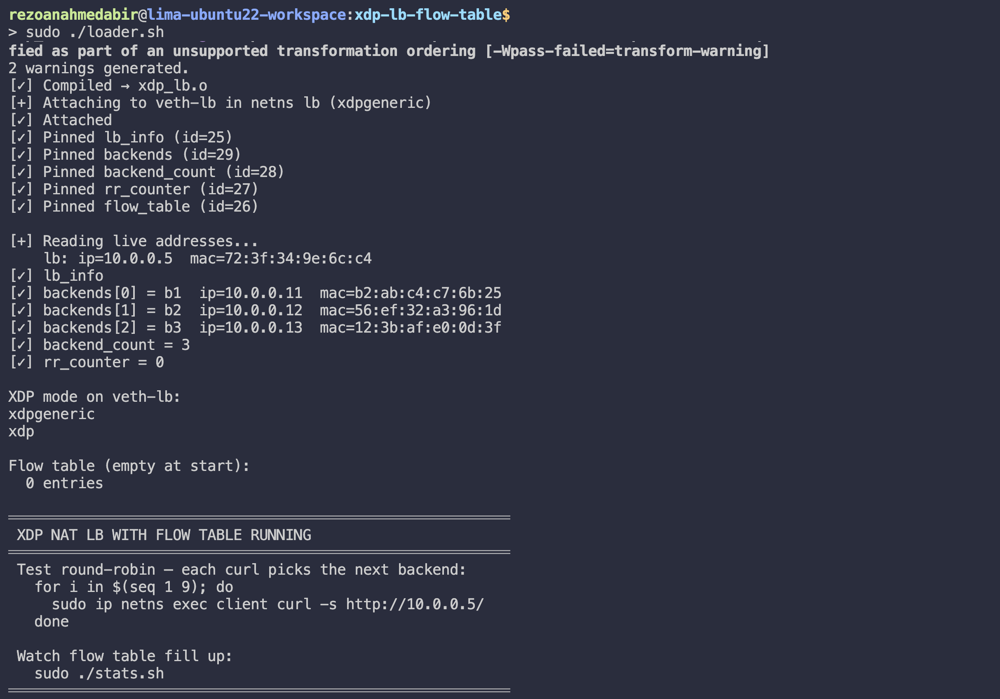
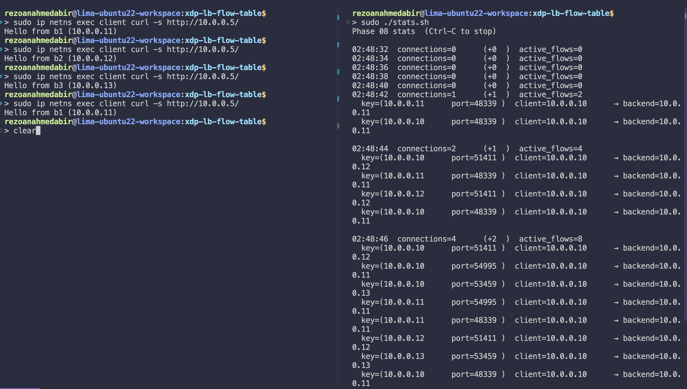
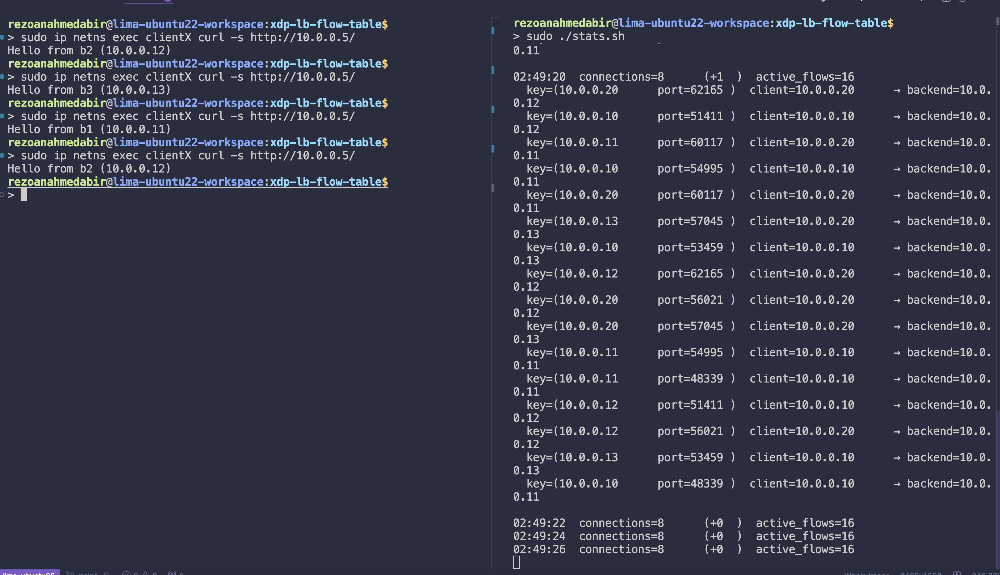
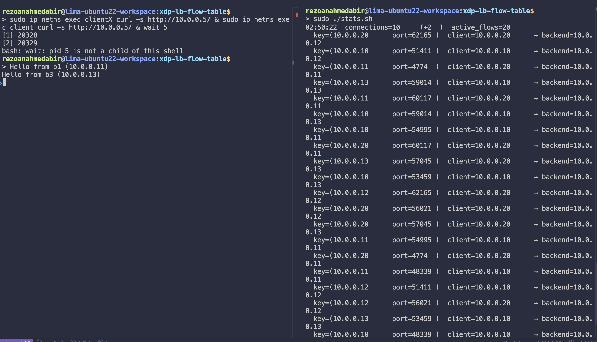

# XDP NAT LB with Flow Table

> The same XDP_TX load balancer as phase 07, with two fundamental limitations removed: single-client restriction and port-hash distribution, replaced by a dual-entry per-connection flow table and true round-robin.

---

## What this phase fixes

Phase 07 had two design limitations that made it unsuitable beyond a single test client:

**Single client only.** The return path read from a hardcoded `client_info` map with one entry written by `loader.sh` at startup. A second client from a different IP would have its replies sent to the wrong destination. The loader had to know the client's IP and MAC before any traffic arrived.

**No true round-robin.** Backend selection used `tcph->source % n`, a hash of the client's ephemeral port. This is stable and race-free, but the distribution is whatever the kernel's port allocator happens to produce. You cannot control which backend gets which connection.

Both are fixed by one mechanism: a **dual-entry flow table**.

---

## What changed from phase 07

| | Phase 07 | Phase 08 |
|---|---|---|
| Backend selection | `sport % n` per packet | Round-robin counter, once per new connection |
| Return path client lookup | `client_info` map (single hardcoded entry) | Flow table lookup by `(backend_ip, client_port)` |
| Multi-client support | No | Yes — any number of simultaneous clients |
| Loader knows client IP at startup | Yes, required | No, learned dynamically from first SYN |
| Flow table entries per connection | N/A | 2, forward key + reverse key |
| Maps | 5 (`lb_info`, `client_info`, `backends`, `backend_count`, `rr_counter`) | 5 (`lb_info`, `backends`, `backend_count`, `rr_counter`, `flow_table`) |
| Flow key | N/A | `{ ip: __u32, port: __u16 }` |

---

## Files

```
xdp-lb-flow-table/
├── xdp_lb.c      ← BPF kernel program
├── loader.sh     ← compile, attach, populate maps
├── stats.sh      ← watch connections + flow table contents
└── bring-down.sh ← detach, unpin, clean up
```

---

## Quick start

```bash
# 1. Topology must be running (with clientX in topology.sh for multi-client test)
cd ../network-namespaces-mental-model
sudo ./bring-up.sh && sudo ./launch-servers.sh

# 2. Attach XDP flow-table LB
cd ../xdp-lb-flow-table
sudo ./loader.sh

# 3. Watch the flow table fill up
sudo ./stats.sh

# 4. Single-client round-robin test
for i in $(seq 1 9); do
    sudo ip netns exec client curl -s http://10.0.0.5/
done

# 5. Multi-client test — run both simultaneously
sudo ip netns exec client  curl -s http://10.0.0.5/ &
sudo ip netns exec clientX curl -s http://10.0.0.5/ &
wait

# 6. Tear down
sudo ./bring-down.sh
```

**Loading XDP Prog**


**Requesting from `client` ns**


**Requesting from `clientX` ns**


**Requesting from both at the same time**


---

## Fundamentals

### The dual-entry flow table —> the core design decision

The fundamental problem with keying the flow table on `client_port` alone is a return-path circular dependency:

```
Return packet arrives:  iph->saddr = backend_ip,  tcph->dest = client_port
We want to look up:     flow_table[{ client_ip, client_port }]
But we don't know:      client_ip  ← it's in the flow value, not the packet
```

To look up the entry we need `client_ip`. To get `client_ip` we need to look up the entry. There is no way to break this cycle with a single-entry-per-connection table without either storing `client_ip` in the return packet (impossible, we already overwrote it on the forward path) or scanning the entire table (O(n), wrong).

**The solution: write two entries per connection on the first SYN.**

```
Forward entry:  key = { ip: client_ip,  port: client_port }
Reverse entry:  key = { ip: backend_ip, port: client_port }
Both entries carry the same flow_val.
```

The return path now has everything it needs without a circular dependency:

```
Return packet:  iph->saddr = backend_ip,  tcph->dest = client_port
Reverse lookup: flow_table[{ ip: backend_ip, port: client_port }]  → O(1) ✓
```

The forward key is used by all subsequent packets of the same connection (ACK, GET, data, FIN). The reverse key is used by all backend replies. Two map writes at SYN time, O(1) lookups forever after.

### The flow key struct

```c
struct flow_key {
    __u32 ip;     // client_ip on forward entry, backend_ip on reverse entry
    __u16 port;   // client's ephemeral port in both cases
    __u16 pad;    // explicit —> verifier rejects uninitialised key bytes
};
```

Generic field names (`ip`, `port`) because the same struct is reused for both entry types. The semantics of `ip` differ by which entry you're writing or reading, but the struct layout is identical.

**Why `(ip, port)` and not the full 4-tuple `(saddr, sport, daddr, dport)`.** On both the forward and return paths, `daddr` is always `lb->ip`, it never varies and adds no discriminating power. `dport` is always 80 on the forward path and always `client_port` on the return path, both derivable from `port`. So `(ip, port)` carries all the information the full 4-tuple would carry in this topology, with a smaller key and faster hash.

**Why explicit `pad`.** The BPF verifier rejects map keys with any uninitialised bytes, implicit compiler padding could contain stack garbage. Explicit `pad` + zero-initialising the struct with `= {}` guarantees every byte is clean before the hash.

### The flow value struct

```c
struct flow_val {
    __u32 backend_ip;
    __u8  backend_mac[ETH_ALEN];
    __u8  pad1[2];
    __u32 client_ip;
    __u8  client_mac[ETH_ALEN];
    __u8  pad2[2];
};
```

Both the forward entry and the reverse entry carry the **same** `flow_val`. This means:

- Forward path packets after the SYN read `backend_ip` and `backend_mac` from the value
- Return path packets read `client_ip` and `client_mac` from the value
- No second lookup needed — both directions get everything from one probe

### Why `BPF_MAP_TYPE_LRU_HASH`

A plain `BPF_MAP_TYPE_HASH` has no eviction policy. When the table fills, new inserts are silently rejected and the connection fails with no error. In a load balancer that runs for hours, every completed TCP connection leaves a stale entry, BPF has no TCP FIN/RST awareness. The table fills and stops accepting new connections.

`BPF_MAP_TYPE_LRU_HASH` automatically evicts the least-recently-used entry when the table is full. No explicit expiry, no garbage-collection goroutine, no map-full errors. Stale entries from finished connections are naturally displaced by new ones over time.

**Why `max_entries = 131072`.** Two entries per connection × 65536 connections (full Linux ephemeral port range of 28,231 ports with headroom) = 131072. Each entry is `sizeof(flow_key) + sizeof(flow_val) = 8 + 20 = 28 bytes` → ~3.5 MB total. The two entries for a connection have the same access pattern so they age out together naturally under LRU eviction.

### How the round-robin counter changes from phase 07

In phase 07, `rr_counter` was read on every forward-path packet, which created a race between concurrent connections where ACK packets could go to a different backend than their SYN. In phase 08:

```
First SYN (no flow entry) → read rr_counter, pick backend, write both entries
All subsequent packets    → read flow entry, never touch rr_counter
SYN retransmit            → forward entry exists, use stored backend
```

The counter advances at most once per new connection. The chosen backend is immediately committed to both flow entries, so all subsequent packets, on any CPU, use the stored value. The per-packet race from phase 07 is eliminated entirely.

The **residual** race: two CPUs handling two new connections simultaneously may both read the same `rr_counter` value and pick the same backend. This is a minor distribution skew, two connections go to the same backend instead of consecutive ones. It does not cause any `RST` or `connection failure`.

### Why SYN retransmits go to the same backend

The forward path checks the flow table first on every packet, including SYNs:

```c
struct flow_val *fval = bpf_map_lookup_elem(&flow_table, &fwd_key);

if (!fval) {
    // No entry: new connection — pick backend, write both entries
} else {
    // Entry exists: use stored backend (handles SYN retransmit correctly)
}
```

If a SYN-ACK is lost and the client retransmits the SYN, the forward entry already exists. The retransmit goes to the same backend as the original SYN. That backend has half-open TCP state for this connection and handles the retransmit correctly. A new backend picked on retransmit would receive a SYN for a connection it knows nothing about and respond with RST.

### `BPF_ANY` in map update

Both `bpf_map_update_elem` calls use `BPF_ANY` (insert or replace), not `BPF_NOEXIST` (fail if exists).

`BPF_NOEXIST` would fail on a SYN retransmit hitting a stale LRU entry, the old entry would remain, potentially pointing to a backend that has since been removed. `BPF_ANY` refreshes both entries on every new flow creation, ensuring they always reflect the currently chosen backend.

### Why storing client identity in the flow value enables multi-client

In phase 07, `loader.sh` wrote `client_ip` and `client_mac` into `client_info` before any traffic arrived. Every return-path packet read from that single slot. A second client's replies were sent to client 1.

In phase 08, the forward path reads `iph->saddr` and `eth->h_source` directly from the arriving SYN:

```c
new_val.client_ip = iph->saddr;
__builtin_memcpy(new_val.client_mac, eth->h_source, ETH_ALEN);
```

The loader never touches client identity. Each flow entry independently records which client owns it. Two clients from different IPs produce flow entries with different `client_ip` values, the return path routes each backend reply to the correct source independently.

---

## Loader walkthrough

The loader is simpler than phase 07: `client_info` is gone. No client population at startup. The client is learned dynamically from the first SYN.

The five maps pinned: `lb_info`, `backends`, `backend_count`, `rr_counter`, `flow_table`. The flow table starts empty. Everything else, compile, `xdpgeneric` attach, `awk`-based map ID extraction, decimal byte tokens, is identical to phase 07.

---

## Observing the flow table with stats.sh

`stats.sh` prints the flow table after each new connection. With the dual-entry design you see two rows per connection, the forward entry and the reverse entry:

```
01:52:03  connections=2  (+1)  active_flows=4
  key=(10.0.0.10       port=54321 )  client=10.0.0.10    → backend=10.0.0.11
  key=(10.0.0.11       port=54321 )  client=10.0.0.10    → backend=10.0.0.11
  key=(10.0.0.20       port=54322 )  client=10.0.0.20    → backend=10.0.0.12
  key=(10.0.0.12       port=54322 )  client=10.0.0.20    → backend=10.0.0.12
```

The first row of each pair has `key.ip = client_ip` (forward entry). The second has `key.ip = backend_ip` (reverse entry). Both carry the same `client → backend` mapping in their values.

---

## Experiments to try

**Verify true round-robin:**
```bash
for i in $(seq 1 9); do
    sudo ip netns exec client curl -s http://10.0.0.5/
done
```
Should produce b1 → b2 → b3 → b1 in strict rotation. Unlike phase 07, distribution is not dependent on the kernel's port allocator.

**Verify multi-client works simultaneously:**
```bash
# Run both in parallel
sudo ip netns exec client  curl -s http://10.0.0.5/ &
sudo ip netns exec clientX curl -s http://10.0.0.5/ &
wait
```
Both should get responses. `stats.sh` should show entries with `client=10.0.0.10` and `client=10.0.0.20`, proof the return path routes to each client independently.

**Observe the dual-entry structure:**
```bash
sudo bpftool map dump pinned /sys/fs/bpf/xdp-lb/flow_table --json | python3 -m json.tool | head -60
```
For each connection you will see two entries with different `key.ip` values but identical `value` content.

**Verify SYN retransmit behaviour:**
```bash
# Drop SYN-ACKs from a backend to force retransmit, then release
sudo ip netns exec lb iptables -A FORWARD -p tcp --tcp-flags SYN,ACK SYN,ACK -j DROP
sudo ip netns exec client curl --max-time 5 -s http://10.0.0.5/ &
sleep 1
sudo ip netns exec lb iptables -D FORWARD -p tcp --tcp-flags SYN,ACK SYN,ACK -j DROP
wait
```
The retransmitted SYN should go to the same backend, you won't see a new flow entry created.

---

## What comes next

Phase 09 adds **per-backend packet and byte counters** using `BPF_MAP_TYPE_PERCPU_ARRAY`. This is where you see why PERCPU matters: the shared ARRAY + atomic add approach from phase 06 generates bus lock traffic under load. PERCPU eliminates all contention by giving each CPU its own counter copy, userspace sums them.

---