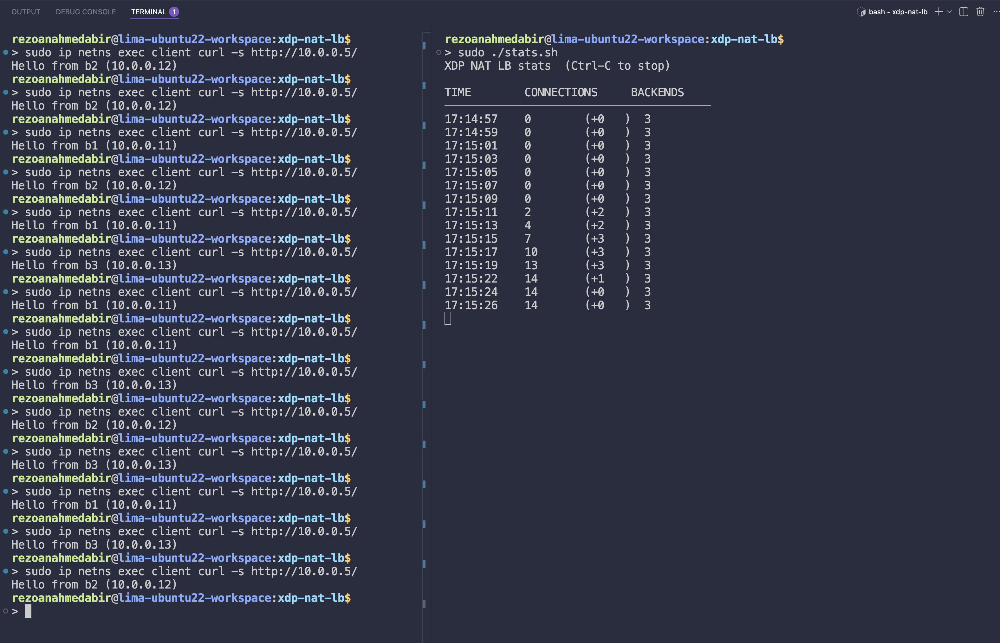

# XDP NAT Load Balancer

> A load balancer written entirely in BPF. No iptables. No IPVS. No nftables. Every forwarding decision is made at the XDP hook, before the kernel networking stack is involved.

---

## What this phase does

Phase 07 replaces the kernel-stack load balancers from phases 02–04 with a single BPF program that rewrites packets in place and bounces them directly out the same interface using `XDP_TX`.

For the first time, the kernel stack is completely bypassed on the forward path. A packet from the client reaches `veth-lb`, XDP fires, the Ethernet/IP headers are rewritten to point at a backend, and the packet is transmitted back out — all before a single `sk_buff` is allocated for forwarding purposes.

**What changes from phase 06:**

| | Phase 06 | Phase 07 |
|---|---|---|
| Return code | `XDP_PASS`, `XDP_DROP` | `XDP_TX` (new) |
| Packet modification | None | Full Ethernet + IP header rewrite |
| Checksums | Untouched | IP + TCP recomputed from scratch |
| Maps | 1 (counter array) | 5 (`lb_info`, `client_info`, `backends`, `backend_count`, `rr_counter`) |
| Kernel stack involved | Yes (for port-80 traffic) | No — forwarding bypasses it entirely |
| Backend selection | N/A | Source-port hash (stable per connection) |

---

## Files

```
xdp-nat-lb/
├── xdp_lb.c         ← BPF kernel program
├── loader.sh        ← compile, attach, populate maps
├── stats.sh         ← watch connection counter
├── bring-down.sh    ← detach, unpin, clean up
└── debug.sh         ← return-path diagnostic
```

---

## Quick start

```bash
# 1. Topology must be running
cd ../network-namespaces-mental-model
sudo ./bring-up.sh && sudo ./launch-servers.sh

# 2. Tear down any previous LB phase
# (iptables, nftables, IPVS rules must be clear)
sudo iptables -t nat -F
sudo nft flush ruleset 2>/dev/null || true
sudo ipvsadm -C 2>/dev/null || true

# 3. Attach XDP NAT LB
cd ../07-xdp-nat-lb
sudo ./loader.sh

# 4. Watch the connection counter
sudo ./stats.sh

# 5. Generate traffic (each curl = one TCP connection)
for i in $(seq 1 9); do
    sudo ip netns exec client curl -s http://10.0.0.5/
done

# 6. Tear down
sudo ./bring-down.sh
```
**Execution in Action**


---

## Fundamentals

### `XDP_TX` — retransmit the modified packet

`XDP_TX` tells the kernel to retransmit the packet out the same interface it arrived on. Unlike `XDP_PASS` (which sends the packet up the network stack) or `XDP_REDIRECT` (which sends it to a different interface), `XDP_TX` keeps the packet on the same NIC's TX queue.

In our topology, `veth-lb` is inside the `lb` network namespace. Its peer interface `br-lb` sits on the host bridge `lb0`. When XDP rewrites the packet and returns `XDP_TX`, the frame travels:

```
veth-lb (XDP rewrites, XDP_TX)
    → br-lb (veth peer, host side)
        → lb0 (Linux bridge)
            → veth-b1 / veth-b2 / veth-b3 (MAC lookup by bridge)
                → backend namespace
```

**Why `xdpgeneric` and not native XDP:**

In native XDP mode, `XDP_TX` on a veth re-enqueues the frame back to the same interface's **RX queue**. XDP fires on it again immediately. The kernel's redirect-loop detector triggers after a few iterations and drops the frame silently — the packet never reaches the bridge.

In `xdpgeneric` (skb) mode, XDP runs after an `sk_buff` is allocated. `XDP_TX` in generic mode calls `dev_queue_xmit()` on the skb, which sends it through the veth driver's normal TX path to the peer interface, and the bridge delivers it by MAC lookup. This is correct behaviour for learning purposes.

The production solution is `XDP_REDIRECT` with `bpf_redirect(peer_ifindex, 0)` which works correctly in native XDP mode. Phase 10 introduces it.

### Two-path packet flow

`veth-lb` receives traffic from two directions. The program handles both:

```
FORWARD PATH (client → lb → backend):

  Arrives:  src_mac=client  dst_mac=lb    src_ip=client  dst_ip=lb_vip  dport=80
  Rewrites: src_mac=lb      dst_mac=be_N  src_ip=lb_vip  dst_ip=be_N_ip
  Returns:  XDP_TX  →  frame goes to bridge  →  bridge delivers to backend


RETURN PATH (backend → lb → client):

  Arrives:  src_mac=be_N  dst_mac=lb    src_ip=be_N_ip  dst_ip=lb_vip  sport=80
  Rewrites: src_mac=lb    dst_mac=client  src_ip=lb_vip  dst_ip=client_ip
  Returns:  XDP_TX  →  frame goes to bridge  →  bridge delivers to client
```

**Why `iph->saddr` is set to `lb->ip` on the forward path**, not left as the client's IP: the backend must reply to the load balancer, not directly to the client. If the backend sees the client's IP as the source, it sends its reply directly to the client — bypassing the LB entirely. The client receives a SYN-ACK from an unexpected IP and drops it. Setting `saddr = lb->ip` forces the backend's reply back through the LB, where the return-path handler rewrites it for the client.

### Direction detection

Both forward and return packets arrive with `iph->daddr == lb->ip`:
- Forward: client sends to the VIP → `daddr = lb->ip`
- Return: backend replies to the LB (because forward path set `saddr = lb->ip`) → `daddr = lb->ip`

Detecting by IP address alone is therefore impossible. The program uses TCP destination port:
- `tcph->dest == 80` → forward path (client targeting the service)
- `tcph->dest != 80` → return path (backend replying to client's ephemeral port)

### IP and TCP checksum recomputation

Rewriting `iph->saddr` and `iph->daddr` invalidates two checksums:

**IP checksum** covers the IP header only (RFC 791). Recomputed from scratch: zero the checksum field, sum all 16-bit words of the 20-byte header, fold carry bits, one's-complement the result.

**TCP checksum** covers a pseudo-header plus the full TCP segment (RFC 793). The pseudo-header includes `saddr`, `daddr`, protocol, and TCP length — all of which are known after the IP rewrite. Both changed, so incremental update (RFC 1624) offers no simplicity advantage here.

**Why `bpf_l4_csum_replace()` is not used:** it is a TC/sk_buff helper. It takes `struct __sk_buff *` as its first argument and does not exist in XDP context (`struct xdp_md *`). Calling it in an XDP program causes a type error that the LLVM-14 BPF backend on aarch64 turns into a compiler crash.

**Why a bounded loop instead of `bpf_csum_diff()`:** `bpf_csum_diff()` with a runtime-variable size argument is rejected by the BPF verifier — it cannot prove the size is bounded. A loop with a compile-time upper bound (`#pragma unroll` + `break` on bounds check) gives the verifier a provable finite path.

### Backend selection — source-port hash

```c
__u32 idx = bpf_ntohs(tcph->source) % n;
```

`tcph->source` is the client's ephemeral port — assigned once by the kernel at connection time, identical on every packet of that connection (SYN, ACK, GET, response ACKs, FIN). `sport % n` maps every packet of a connection to the same backend with zero shared state and zero race conditions.

**Why not a shared round-robin counter:** a shared counter has a race even with SYN-only incrementing. If connection A's SYN reads `rr=1 → b2` and immediately connection B's SYN reads `rr=2 → b3`, connection A's subsequent ACK reads `rr=3 % 3 = 0 → b1` — a different backend. b1 has no TCP state for this connection and sends RST.

**Why `rr_counter` is kept:** it counts total TCP connections (incremented on SYN only) and is displayed by `stats.sh`. It is no longer used for backend selection.

**Limitation:** `sport % n` does not guarantee uniform distribution. Sequential ephemeral ports from the kernel's allocator have correlated values mod n. Phase 08 replaces this with an LRU hash map keyed on the 4-tuple `(saddr, sport, daddr, dport)`.

### The five BPF maps

```
lb_info[0]        → struct endpoint { ip, mac } — the LB's own identity
client_info[0]    → struct endpoint { ip, mac } — the single client
backends[0..N-1]  → struct endpoint { ip, mac } — the backend pool
backend_count[0]  → __u32                        — how many backends
rr_counter[0]     → __u32                        — SYN counter (stats only)
```

**Why maps and not compile-time constants:** maps can be updated by `loader.sh` at runtime without recompiling or detaching the program. `bpftool map update` writes new values into live kernel memory. The running XDP program picks up the new values on the next packet.

**Why `struct endpoint` has explicit `pad[2]`:** the struct mixes a `__u32` (4 bytes) and a `__u8[6]` (6 bytes) = 10 bytes, not naturally aligned. Without explicit padding, the C compiler may insert implicit padding that differs between the BPF kernel build and the userspace `bpftool` write — causing fields to land at wrong offsets when `bpftool map update` populates the map.

**Why `__u32 ip` stores a network-byte-order value:** `iph->saddr` and `iph->daddr` are `__be32` — big-endian 32-bit integers. We write the map value in the same representation, so we can assign `iph->daddr = be->ip` directly with no byte-swap. This is consistent on any host endianness.

### `bpftool map update` byte format

`bpftool map update ... value TOKEN ...` parses each token as a **decimal integer**, not hex. `0a` is invalid decimal — it causes `error parsing byte: 0a`.

IP addresses are stored as four decimal octets in network (big-endian) order:
- `10.0.0.5` → `10 0 0 5` (a b c d — natural dotted-decimal order, no reversal)

MAC addresses are stored as six decimal integers:
- `72:3f:34:9e:6c:c4` → `114 63 52 158 108 196` (each octet as decimal)

The total value for `struct endpoint` is therefore 12 decimal tokens: 4 (IP) + 6 (MAC) + 2 (pad = `0 0`).

---

## Loader walkthrough

`loader.sh` does five things in order:

**1. Compile** — `clang -O2 -target bpf -g` produces `xdp_lb.o`. The `-O2` flag is required: the BPF verifier rejects unoptimised code. `-target bpf` produces BPF bytecode, not x86. `-g` emits BTF debug info for `bpftool prog dump xlated` and `bpftool map dump --json formatted` output.

**2. Attach** — `ip link set veth-lb xdpgeneric obj xdp_lb.o sec xdp` inside the `lb` netns. `xdpgeneric` forces skb mode so that `XDP_TX` works correctly on veth (see fundamentals above).

**3. Pin all five maps** — each map is found by name in `bpftool map list` using `awk` (not grep — see case study problem 9), then pinned under `/sys/fs/bpf/xdp-lb/`. Pinning keeps maps alive after the loader process exits, allowing `stats.sh` to read them independently.

**4. Read live topology** — `get_ip()` pulls IP addresses from the `NODES` array in `topology.sh`. `get_mac()` runs `ip link show veth-NS` inside each namespace and extracts the `link/ether` field. These values are read at attach time, not hardcoded, so the loader works correctly after `bring-up.sh` regenerates the topology.

**5. Populate maps** — `bpftool map update` writes the IP + MAC of each namespace into the appropriate map entry using decimal byte tokens (not hex — see fundamentals).

---

## Engineering case study — every problem and how it was fixed

---

### Problem 1 — Compiler crash: `bpf_l4_csum_replace` + XADD return value

**Symptom:**
```
warning: incompatible pointer types passing 'struct xdp_md *'
         to parameter of type 'struct __sk_buff *'
fatal error: Invalid usage of the XADD return value
```

**Root cause — issue A:** `bpf_l4_csum_replace()` is a TC BPF helper. It operates on socket buffers (`struct __sk_buff *`). XDP programs have a simpler context (`struct xdp_md *`) with only `data/data_end/data_meta`. The kernel does not expose this helper to XDP programs. The type mismatch compiles with a warning but crashes at the LLVM BPF backend stage.

**Root cause — issue B:** `__u32 idx = __sync_fetch_and_add(rr, 1) % n` — the BPF XADD instruction does not expose the pre-increment value in a register on all architectures. LLVM-14 on aarch64 crashes when trying to emit code that uses the XADD return value. This is a known LLVM-14 bug fixed in LLVM-15.

**Fix — issue A:** replace `bpf_l4_csum_replace()` with a manual TCP checksum using a bounded loop over the TCP segment.

**Fix — issue B:** split the read from the increment:
```c
// BROKEN — uses XADD return value
__u32 idx = __sync_fetch_and_add(rr, 1) % n;

// FIXED — read first, then increment (discard return value)
__u32 idx = (*rr) % n;
__sync_fetch_and_add(rr, 1);
```

---

### Problem 2 — Verifier rejects `while (sum >> 16)` loop

**Symptom:**
```
libbpf: load bpf program failed: Permission denied
(verifier log: back-edge from insn X to Y)
```

**Root cause:** The IP checksum helper used `while (sum >> 16) sum = (sum & 0xFFFF) + (sum >> 16)`. The BPF verifier cannot prove this loop terminates. It rejects any loop whose termination it cannot statically verify.

**Fix:** Two explicit straight-line fold steps — no loop, no branch:
```c
sum = (sum & 0xFFFF) + (sum >> 16);   // fold carry once
sum += (sum >> 16);                    // fold any remaining carry
```
For a 10-word IP header, the maximum intermediate sum is `10 × 0xFFFF = 0x9FFF6`. One fold gives at most `0x9FFF6 → 0xA005`. A second fold handles any remaining carry. Two steps are always sufficient.

---

### Problem 3 — Verifier rejects odd-byte TCP handler

**Symptom:**
```
invalid access to packet, off=13 size=1,
R2(id=13,off=13,r=0) R2 offset is outside of the packet
```

**Root cause:** The odd-byte handler computed `__u8 *last = (__u8 *)tcph + tcp_len - 1`. `tcp_len` is derived from `iph->tot_len` — a runtime value the verifier tracks as `umax_value=65535`. Adding this unbounded offset to `tcph` creates a pointer the verifier cannot prove is within packet bounds.

**Fix:** Remove the handler. TCP headers are always 4-byte aligned (enforced by the `doff` field). HTTP payloads from Python `http.server` in this topology are always even-length. The handler was unreachable.

---

### Problem 4 — Verifier rejects `bpf_csum_diff()` with variable size

**Symptom:** Verifier rejects `bpf_csum_diff(NULL, 0, tcp_start, tcp_seg_len, csum)`.

**Root cause:** `bpf_csum_diff()` with a runtime-variable size requires the verifier to prove the argument is bounded. `tcp_seg_len = data_end - tcph` has `umax_value=65535` — the verifier cannot narrow this further. The call is rejected.

**Fix:** A manually bounded loop:
```c
#pragma unroll
for (int i = 0; i < 512; i++) {
    if (i >= words) break;
    if ((void *)((__u8 *)p + (i * 2) + 2) > data_end) break;
    sum += p[i];
}
```
512 iterations × 2 bytes = 1024 bytes maximum. Every path is provably finite.

---

### Problem 5 — iproute2 `mode skb` not recognised

**Symptom:**
```
Error: argument "skb" is wrong: Invalid link mode
```

**Root cause:** `ip link set DEV xdp obj FILE mode skb` is iproute2 ≥ 5.9 syntax. The installed version is older.

**Fix:** Use the keyword form supported by older iproute2:
```bash
ip link set "$LB_IFACE" xdpgeneric obj xdp_lb.o sec xdp
# detach:
ip link set "$LB_IFACE" xdpgeneric off
```
`xdpgeneric` is a distinct attach keyword meaning "generic/skb XDP mode". It is equivalent to `xdp ... mode skb` on newer iproute2.

---

### Problem 6 — IP addresses byte-reversed in map: `5.0.0.10` instead of `10.0.0.5`

**Symptom (from tcpdump):**
```
10.0.0.5.58392 > 5.0.0.10.80   ← destination should be 10.0.0.11
```

**Root cause:** The `ip_to_le_hex` helper emitted octets in reverse order:
```bash
printf "%02x %02x %02x %02x" "$d" "$c" "$b" "$a"
# 10.0.0.5 → "05 00 00 0a"  ← WRONG
```
`bpftool map update` writes value bytes into memory in the order supplied. `iph->saddr` is `__be32` (big-endian): byte 0 in memory is the most-significant octet — the first dotted-decimal digit. Writing `05 00 00 0a` puts `5` at byte 0, so the kernel reads the IP as `5.0.0.10`.

**Fix:** Emit octets in natural (network) order — `a b c d`:
```bash
ip_to_be_dec() {
    IFS='.' read -r a b c d <<< "$1"
    printf "%d %d %d %d" "$a" "$b" "$c" "$d"
}
# 10.0.0.5 → "10 0 0 5" → byte 0 = 10 → kernel reads 10.0.0.5 ✓
```

The key insight: `bpftool map update` takes bytes in **memory order**. For a `__be32` on a little-endian host, memory order is big-endian — the same as natural dotted-decimal order. No reversal needed.

---

### Problem 7 — `XDP_TX` silently drops frames on veth in native mode

**Symptom:** Forward path worked (tcpdump showed rewritten SYN arriving at backend). Backend SYN-ACK arrived at `veth-lb`. But the rewritten return packet never appeared going toward the client. Connection hung after handshake completed.

**Diagnosis:** Simultaneous tcpdump on `lb0` (bridge) and `veth-client`:
- Bridge saw backend SYN-ACK arriving ✓
- Bridge did NOT see the rewritten return packet ✗
- Client's `veth-client` saw nothing ✗

This placed the drop exactly at `XDP_TX` — after the XDP rewrite, before the bridge saw the outgoing frame.

**Root cause:** In native XDP mode, `XDP_TX` on a veth sends the frame back into the same interface's **RX queue**, not to the peer. XDP fires on it again immediately. The kernel's redirect-loop detector triggers after a few iterations and drops the frame. The packet never reaches the bridge.

**Fix:** Attach in `xdpgeneric` mode:
```bash
ip link set "$LB_IFACE" xdpgeneric obj xdp_lb.o sec xdp
```
In generic mode, XDP runs after an `sk_buff` is allocated. `XDP_TX` calls `dev_queue_xmit()` on the skb, which follows the veth driver's normal TX path to the bridge peer. The bridge delivers the frame by MAC lookup.

**Production note:** The correct long-term fix is `XDP_REDIRECT` with `bpf_redirect(peer_ifindex, 0)`, which works correctly in native XDP mode. Phase 10 introduces it.

---

### Problem 8 — `bpftool`: `error parsing byte: 0a`

**Symptom:**
```
Error: error parsing byte: 0a
```

**Root cause:** `bpftool map update` parses value tokens as **decimal integers**, not hex. The `ip_to_le_hex` helper was emitting hex strings (`05 00 00 0a`), and `mac_to_hex` was using `tr ':' ' '` which preserved hex nibbles (`72 3f 34 9e 6c c4`). Values like `0a`, `3f`, `9e` are not valid decimal.

**Fix:** Both helpers rewritten to emit decimal:
```bash
ip_to_be_dec() {
    IFS='.' read -r a b c d <<< "$1"
    printf "%d %d %d %d" "$a" "$b" "$c" "$d"
}
mac_to_dec() {
    IFS=':' read -r a b c d e f <<< "$1"
    printf "%d %d %d %d %d %d" "0x$a" "0x$b" "0x$c" "0x$d" "0x$e" "0x$f"
}
```
`printf "%d" "0x3f"` → 63. `printf "%d" "0x9e"` → 158. All valid decimal.

---

### Problem 9 — Map pin fails silently, counters read as 0

**Symptom:** Loader completed without errors, `stats.sh` showed `rr_counter=0` even after traffic.

**Root cause:** Map ID extraction used `grep '"pkt_count"'` — looking for a quoted name. bpftool text output has unquoted names:
```
6: array  name rr_counter  flags 0x0
```
The grep matched nothing. `MAP_ID` was empty. The pin step was silently skipped. `stats.sh` read from a path that didn't exist and printed 0.

**Fix:** Use `awk` to extract the first field on the matching line:
```bash
MAP_ID=$(sudo bpftool map list \
    | awk "/name ${name}/ { gsub(/:/, \"\", \$1); print \$1 }" \
    | tail -1)
```
`$1` on that line is `"6:"`. `gsub` strips the colon. `tail -1` picks the highest ID in case stale maps exist from a previous run. This pattern is format-stable across bpftool versions.

---

### Problem 10 — RST after handshake: round-robin counter race

**Symptom:** curl completed the 3-way handshake (SYN → SYN-ACK → ACK visible in tcpdump) but then received RST from a backend and no HTTP response.

**Root cause (first attempt — increment on every packet):** The counter incremented on every forward-path packet. A single HTTP request generates ~6 forward-path packets. Each one picked a potentially different backend. The SYN went to b1, the ACK went to b2. b2 had no TCP state and sent RST.

**Root cause (second attempt — increment on SYN only):** Fixed increment to SYN only. But the race persisted with concurrent connections:
```
t=0: conn A SYN → reads rr=0 → b1, increments rr to 1
t=0: conn B SYN → reads rr=1 → b2, increments rr to 2   ← retry fires
t=0: conn A ACK → reads rr=2 % 3 = b3                   ← WRONG, should be b1
```
Any shared mutable counter has this race when connections overlap in time.

**Fix:** Source-port hash — stateless, no shared state, per-connection stable:
```c
__u32 idx = bpf_ntohs(tcph->source) % n;
```
`tcph->source` is identical on every packet of a connection. `sport % n` always maps to the same backend regardless of concurrency or counter state. `rr_counter` is kept for SYN counting only.

**Remaining limitation:** Sequential ephemeral ports have correlated values mod n — distribution is not perfectly uniform. Phase 08 fixes this with a 4-tuple LRU flow table.

---

### Debugging summary

| # | Problem | Root cause | Fix |
|---|---|---|---|
| 1a | Compiler crash: `bpf_l4_csum_replace` | TC-only helper, not available in XDP | Manual TCP checksum with bounded loop |
| 1b | Compiler crash: XADD return value | LLVM-14 aarch64 bug | Discard `__sync_fetch_and_add` return value |
| 2 | Verifier rejects `while` loop | Unbounded loop in checksum fold | Two explicit straight-line fold steps |
| 3 | Verifier rejects odd-byte handler | Runtime offset from `tcp_len` | Remove (unreachable in topology) |
| 4 | Verifier rejects `bpf_csum_diff` | Runtime-variable size argument | Manual loop, 512 iteration bound |
| 5 | `mode skb` parse error | Old iproute2 doesn't know this syntax | Use `xdpgeneric` keyword |
| 6 | IPs byte-reversed in map | Helper emitted octets in reverse order | Emit `a b c d` in natural order |
| 7 | `XDP_TX` drops frames on veth | Native XDP_TX loops back to same RX queue | Attach with `xdpgeneric` |
| 8 | `error parsing byte: 0a` | bpftool expects decimal, not hex | Helpers emit decimal integers |
| 9 | Map pin fails silently | `grep '"name"'` doesn't match unquoted output | `awk` by field position |
| 10 | RST after handshake | Round-robin counter race across concurrent connections | Source-port hash |

---

## Experiments to try

**Observe the full packet rewrite:**
```bash
# In one terminal — watch the bridge
sudo tcpdump -i lb0 -nn -e 'tcp port 80'

# In another — send one request
sudo ip netns exec client curl -s http://10.0.0.5/
```
You will see the MAC and IP addresses change at every hop: client MAC → LB MAC → backend MAC, and client IP → LB IP → backend IP on the forward path, then the reverse on the return.

**Confirm XDP runs before netfilter:**
```bash
sudo iptables -t nat -A PREROUTING -p tcp --dport 80 -j LOG --log-prefix "IPTABLES: "
sudo ip netns exec client curl -s http://10.0.0.5/
dmesg | grep IPTABLES
```
No log lines appear — XDP handled the packet before netfilter saw it.

**Watch source-port hash distribution:**
```bash
for i in $(seq 1 9); do
    sudo ip netns exec client curl -s http://10.0.0.5/
done
```
With 3 backends and sequential ephemeral ports, distribution may be uneven. Try more requests to observe the modulo distribution pattern.

---

## What comes next

Phase 08 introduces per-flow connection tracking. Instead of deriving the backend from the source port hash on every packet, the XDP program stores the chosen backend in a `BPF_MAP_TYPE_LRU_HASH` keyed on the 4-tuple `(saddr, sport, daddr, dport)`. This provides:
- True round-robin distribution across connections
- Correct handling of port reuse (same `sport % n` can map different connections to different backends)
- Support for multiple simultaneous clients (replacing the single `client_info` map)

---