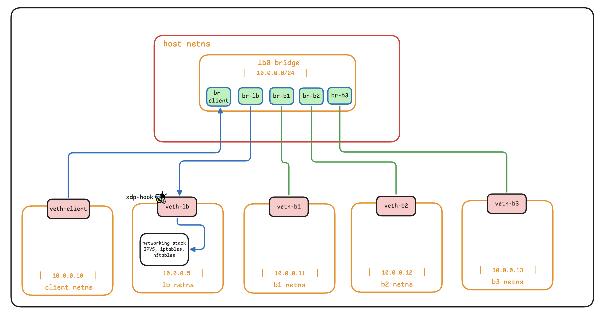
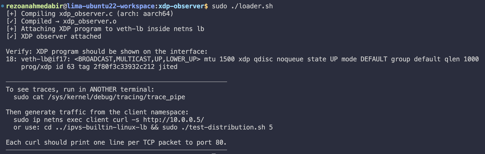
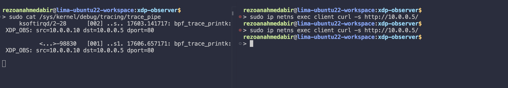

# XDP Observer

> Attach a BPF/XDP program to a virtual NIC inside a network namespace, intercept every TCP packet destined for port 80, and print one trace line per packet, all without touching the kernel networking stack.

---

## What is this?

This phase wires a minimal **eBPF XDP program** to the `veth-lb` interface inside the `lb` network namespace. It reads each arriving Ethernet frame at the earliest possible kernel hook, before iptables, before IPVS, before nftables, logs the source/destination IPs, and then passes the packet on unchanged.

It is a pure **observer**: it does not drop, modify, or redirect anything. Its only job is to prove you can see packets at the XDP layer and that `XDP_PASS` correctly hands control back to whatever netfilter rules are already running.

---

## Architecture



**Why `veth-lb` and not the bridge `lb0`?**

The XDP hook is wired to the *receive path* of a network interface, it fires when a frame arrives on a NIC. Linux bridges do not expose an XDP receive hook the same way veth pairs do. Attaching to a bridge requires **TC** (Traffic Control) BPF programs (`BPF_PROG_TYPE_SCHED_CLS`, `TC_ACT_*` return codes), which is a different hook entirely.

`veth-lb` is the virtual NIC that the `lb` namespace uses to talk to the bridge. From that namespace's perspective it *is* the NIC, analogous to `eth0` on a physical load-balancer server. Attaching XDP there is the correct model for what this series builds toward.

---

## Files

```
xdp-observer/
├── xdp_observer.c   — BPF kernel program (compiled to BPF bytecode)
├── loader.sh        — compile + attach
└── bring-down.sh    — detach + cleanup
```

---
## Why not <netinet/in.h> or <arpa/inet.h>?

Those are *userspace* **glibc** headers.  The BPF virtual machine runs in kernel context; only kernel headers describe the actual in-memory layout of `sk_buffs` and packet data.  Mixing them causes subtle struct-layout mismatches.

## Why (void *)(long)?

`ctx->data` is a `__u32 (32-bit)`.  On a 64-bit system a pointer is **64-bit**. Casting directly from **__u32** to `void*` would sign-extend incorrectly on some compilers.  The intermediate cast to **(long)** zero-extends properly. This is the canonical pattern in every XDP program you will ever read.

## Why does the verifier require to check Ethernet header bounds?

XDP programs run inside the kernel with direct memory access.  There is no page-fault handler to catch **out-of-bounds** reads, they would corrupt kernel memory or read garbage.  The verifier statically simulates every possible execution path and rejects programs that might read past `data_end`.  The check `eth + 1 > data_end` is the canonical way to say "does the region [eth, eth + sizeof(*eth)] fit?", because pointer arithmetic on typed pointers scales by sizeof automatically.

```bash
The `+ 1` idiom:
eth + 1  ≡  (struct ethhdr *)eth + 1
         ≡  (char *)eth + sizeof(struct ethhdr)

So `(void *)(eth + 1) > data_end` means "would the byte one past the end of ethhdr overflow the packet?".
```
 
## Why `XDP_ABORTED` and not `XDP_DROP`?

`XDP_ABORTED` increments a dedicated error counter that `bpftool` and `perf` can observe.  It signals "something unexpected happened" rather than "I made a deliberate drop decision".  Use it for error paths; use `XDP_DROP` for deliberate filtering.

## Quick start

### Prerequisites

The network topology from phase 01 must be running:

```bash
cd ../network-namespaces-mental-model
sudo ./bring-up.sh
sudo ./launch-servers.sh
```

You need `clang`, `llvm`, and `linux-headers` (or `libbpf-dev`) installed:

```bash
# Debian / Ubuntu
sudo apt install clang llvm libelf-dev linux-headers-$(uname -r) libbpf-dev
```

### Attach the observer

```bash
cd xdp-observer
sudo ./loader.sh
```

Expected output:



### Watch the trace

In a second terminal:

```bash
sudo cat /sys/kernel/debug/tracing/trace_pipe
```

### Generate traffic

In a third terminal:

```bash
sudo ip netns exec client curl -s http://10.0.0.5/
```

You should see one line per TCP packet in the trace terminal:



A single `curl` produces roughly 6–8 packets (SYN, SYN-ACK, GET, data, ACK, FIN…).

### Tear down

```bash
sudo ./bring-down.sh
```

This detaches the XDP program and removes `xdp_observer.o`.

---

## What this proves

**XDP fires before netfilter.** You can run phase 04 (nftables LB) simultaneously with this observer and both work, `XDP_PASS` hands the packet to netfilter after the trace line is written.

**The BPF verifier accepted the program.** Every pointer dereference is preceded by a bounds check. Remove any one of those checks, recompile, and try to attach —> the kernel will reject the object with a verifier error pinpointing the unsafe instruction.

---

## How the program works

The packet filter chain runs in this order for every arriving frame:

| Step | What it checks | On failure |
|------|---------------|------------|
| 1 | Ethernet header fits in packet | `XDP_ABORTED` |
| 2 | EtherType == IPv4 (0x0800) | `XDP_PASS` (ARP, IPv6…) |
| 3 | IPv4 header fits in packet | `XDP_ABORTED` |
| 4 | `iph->protocol` == TCP (6) | `XDP_PASS` (UDP, ICMP…) |
| 5 | TCP header fits in packet | `XDP_ABORTED` |
| 6 | `tcph->dest` == 80 | `XDP_PASS` (other ports) |
| 7 | `bpf_printk()` → `trace_pipe` | — |

**Notable implementation details:**

- `iph->ihl * 4` —> not `sizeof(struct iphdr)`. The IP header length field is in 32-bit words and can be up to 60 bytes when options are present. Using the fixed 20-byte struct size would point into garbage on any packet with IP options.

- `bpf_htons()` not `htons()` —> `htons()` is a **glibc** function that does not exist in BPF kernel context. `bpf_htons()` is a macro in `bpf_endian.h` that emits `__builtin_bswap16`, which the BPF backend compiles to a single byte-swap instruction.

- `&iph->saddr` not `iph->saddr` for `%pI4` —> the kernel's `%pI4` printf extension *dereferences* the pointer to print dotted-decimal. Passing the value instead of the address prints garbage.

- `XDP_ABORTED` not `XDP_DROP` on malformed packets —> `XDP_ABORTED` increments a dedicated error counter visible in `bpftool` and `perf`. It signals "something unexpected" rather than a deliberate drop decision.

---

## XDP return codes 

| Code | Meaning |
|------|---------|
| `XDP_ABORTED` | Error path — increments error counter, packet dropped |
| `XDP_DROP` | Deliberate discard before the stack sees the packet |
| `XDP_PASS` | Hand the packet to the normal kernel networking stack |
| `XDP_TX` | Retransmit the (possibly modified) packet out the same interface |
| `XDP_REDIRECT` | Forward to a different interface or CPU |

---

## Compilation flags

```bash
clang -O2 -target bpf -g \
    -I/usr/include/$(uname -m)-linux-gnu \
    -c xdp_observer.c -o xdp_observer.o
```

| Flag | Why it is required |
|------|--------------------|
| `-O2` | The BPF verifier rejects unoptimised code —> without it, loops don't collapse into bounded forms the verifier can analyse |
| `-target bpf` | Emit BPF bytecode, not x86. Without this you get an x86 ELF the kernel cannot load |
| `-g` | Emit DWARF/BTF debug info —> enables readable `bpftool prog dump xlated` output. Zero runtime cost |
| `-I/usr/include/$(uname -m)-linux-gnu` | Architecture-specific kernel headers (`ethhdr`, `iphdr`, `tcphdr`). The path varies: `x86_64-linux-gnu` on amd64, `aarch64-linux-gnu` on ARM |

---

## Experiments to try

### 1. Remove a bounds check

Delete the `if ((void *)(iph + 1) > data_end)` block, recompile, and try to attach:

```bash
sudo ./loader.sh
```

The kernel will print a verifier error showing the exact instruction that reads past the safe region. This is the verifier doing its job.

### 2. Change the port filter

In `xdp_observer.c`, replace:

```c
if (tcph->dest != bpf_htons(80))
```

with:

```c
if (tcph->dest != bpf_htons(22))
```

Recompile and reattach. SSH packets now appear in the trace; port 80 traffic is silent.

### 3. Add a packet counter (and observe the race)

Add before `bpf_printk`:

```c
static __u32 pkt_count = 0;
pkt_count++;
```

It compiles and increments —> but on a multi-core machine the counter races.

### 4. Run alongside a previous phase

Start the nftables LB from phase 04, then attach this observer. Both work simultaneously: XDP fires first, prints the trace, then `XDP_PASS` hands the packet to nftables. This is the key insight —> XDP hooks stack with existing netfilter rules during the learning process.

---
