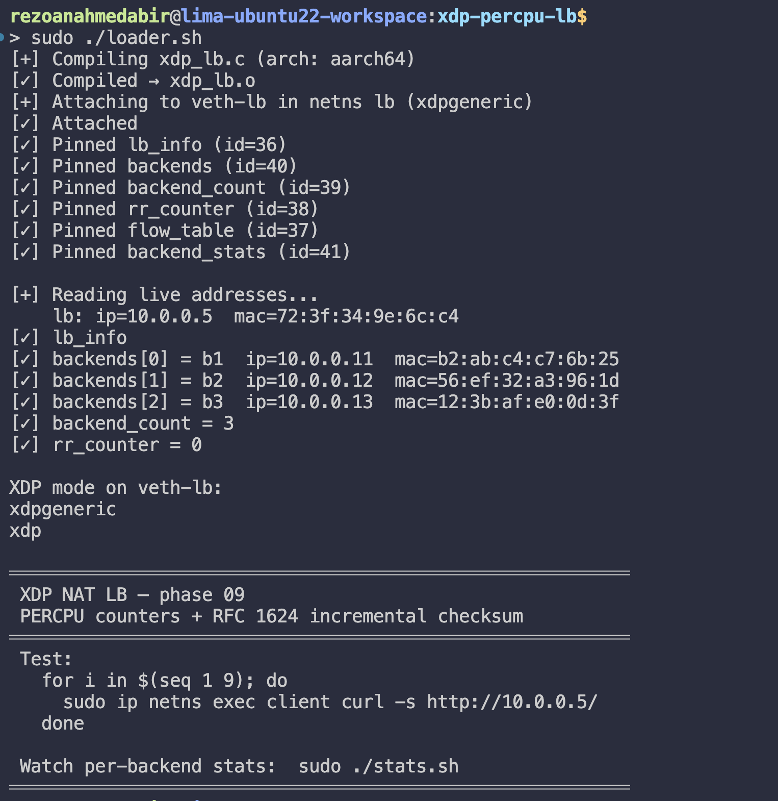
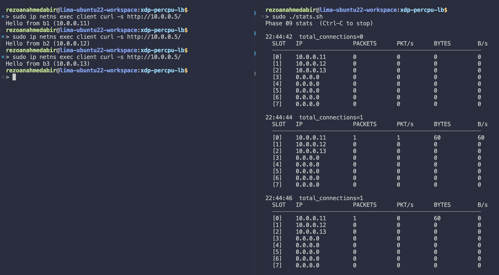
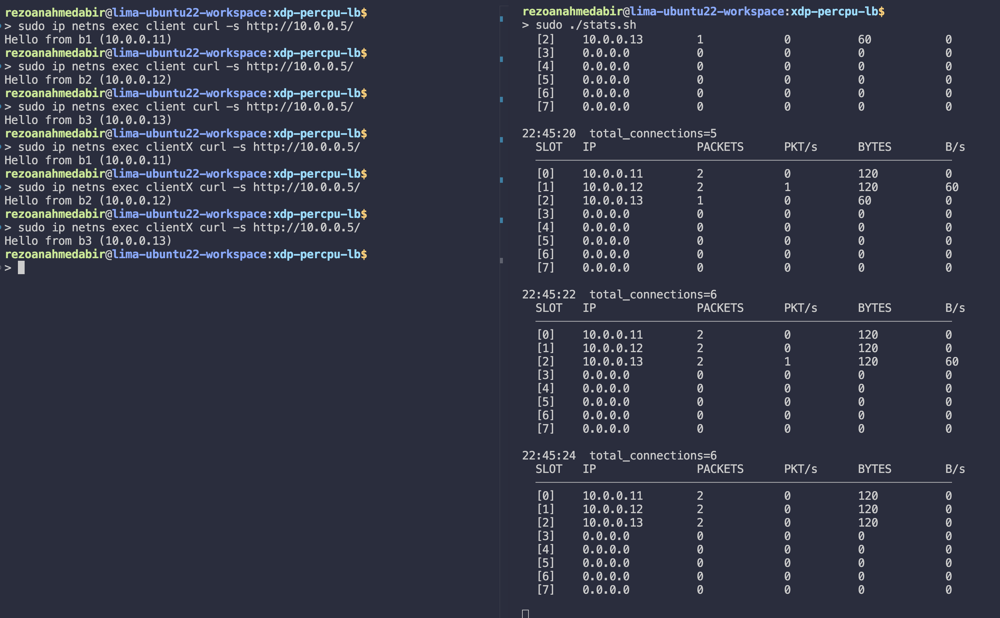

# PERCPU Counters + Incremental Checksum

> Phase 08 forwarding logic unchanged. Two targeted improvements: atomic-free per-backend counters that scale with CPU count, and O(1) checksum updates that work correctly for any packet size.

---

## What this phase fixes

**Shared counter contention.** Every phase since 06 that needed counting used `BPF_MAP_TYPE_ARRAY + __sync_fetch_and_add`. That generates a `LOCK XADD` bus lock instruction on every increment. On a multi-core machine, CPUs serialise on that lock, one CPU holds it, all others stall. The cost grows with core count and packet rate. Replaced with `BPF_MAP_TYPE_PERCPU_ARRAY`: each CPU has its own counter slot, increments it with a plain store, and userspace sums the per-CPU values when reading.

**The 512-word TCP checksum limit.** Phases 07 and 08 recomputed the TCP checksum by scanning the entire TCP segment in a bounded loop. The verifier-safe upper bound was 512 iterations × 2 bytes = 1024 bytes. Any full-MTU segment carries 1460 bytes of TCP payload, already over the limit. TLS handshakes (~4KB) and large HTTP responses are broken silently: the loop exits early, the checksum is wrong, the receiver drops the packet. Replaced with RFC 1624 incremental update: since only `saddr` and `daddr` change, the adjustment is computed in O(1) with no loop and no payload scan.

---

## What changed from phase 08

| | Phase 08 | Phase 09 |
|---|---|---|
| TCP checksum | Full recompute, 512-word loop | RFC 1624 incremental, O(1) |
| IP checksum | Full recompute, 10-word loop | RFC 1624 incremental, O(1) |
| Per-backend counters | None | `PERCPU_ARRAY` —> packets + bytes |
| Maps | 5 | 6 (`backend_stats` added) |
| Forwarding logic | Dual-entry flow table | Unchanged |

---

## Files

```
xdp-percpu-lb/
├── xdp_lb.c      ← BPF kernel program
├── loader.sh     ← compile, attach, populate maps
├── stats.sh      ← per-backend packets/bytes/rate from PERCPU values
└── bring-down.sh ← detach, unpin, clean up
```

---

## Quick start

```bash
# 1. Topology must be running
cd ../network-namespaces-mental-model
sudo ./bring-up.sh && sudo ./launch-servers.sh

# 2. Attach
cd ../xdp-percpu-lb
sudo ./loader.sh

# 3. Watch per-backend stats
sudo ./stats.sh

# 4. Generate traffic
for i in $(seq 1 9); do
    sudo ip netns exec client curl -s http://10.0.0.5/
done

# 5. Tear down
sudo ./bring-down.sh
```

**Loader Output**



**From the first client Stats output**



**From the both Stats output**



---

## Fundamentals

### The bus lock problem

A `BPF_MAP_TYPE_ARRAY` with `__sync_fetch_and_add` compiles to a `LOCK XADD` instruction. On x86, `LOCK` asserts the bus lock signal, it tells every other CPU "don't touch this cache line until I'm done." The sequence is:

```
CPU 0 processes packet:  LOCK XADD [counter], 1   ← holds the lock
CPU 1 processes packet:  LOCK XADD [counter], 1   ← stalls
CPU 2 processes packet:  LOCK XADD [counter], 1   ← stalls
CPU 3 processes packet:  LOCK XADD [counter], 1   ← stalls
```

Three CPUs doing no useful work while one completes an atomic add. At low packet rates this is negligible. At XDP speeds (millions of packets per second per core), it becomes a measurable bottleneck.

### PERCPU_ARRAY — one slot per CPU

`BPF_MAP_TYPE_PERCPU_ARRAY` allocates a separate copy of the value array for every CPU. When the XDP program on CPU 2 looks up index 0, it gets CPU 2's private copy. No other CPU ever reads or writes that memory location during normal operation:

```
CPU 0:  backend_stats[0] = { packets: 142, bytes: 18632 }   (CPU 0's copy)
CPU 1:  backend_stats[0] = { packets: 139, bytes: 18243 }   (CPU 1's copy)
CPU 2:  backend_stats[0] = { packets: 145, bytes: 19025 }   (CPU 2's copy)
CPU 3:  backend_stats[0] = { packets: 138, bytes: 18114 }   (CPU 3's copy)
```

The XDP program increments with a plain store — no atomic instruction needed. The verifier accepts it because the PERCPU semantics guarantee no concurrent access from another CPU.

Userspace reads all per-CPU copies via `bpftool map dump --json` and sums them:

```
total packets for backend 0 = 142 + 139 + 145 + 138 = 564
```

This aggregation happens only when `stats.sh` polls, every 2 seconds in our case. The XDP program never pays for the aggregation cost.

### `bpftool` PERCPU_ARRAY JSON shape

When BTF is present, `bpftool map dump --json` on a PERCPU_ARRAY emits a `values` array per entry rather than a single `value`:

```json
[
  {
    "key": 0,
    "values": [
      {"cpu": 0, "value": {"packets": 142, "bytes": 18632}},
      {"cpu": 1, "value": {"packets": 139, "bytes": 18243}},
      {"cpu": 2, "value": {"packets": 145, "bytes": 19025}},
      {"cpu": 3, "value": {"packets": 138, "bytes": 18114}}
    ]
  },
  {
    "key": 1,
    "values": [...]
  }
]
```

`stats.sh` iterates `values`, sums `packets` and `bytes` across all CPU entries per key, and tracks previous values to show a per-poll delta.

### RFC 1624 incremental checksum

The IP and TCP checksums are one's-complement sums. When a field changes, only that field's contribution to the sum changes, the rest of the header and payload are untouched. RFC 1624 gives the exact formula for updating a checksum when one 32-bit word changes:

```
new_checksum = ~(~old_checksum + ~old_value + new_value)
```

The `csum_diff4` helper implements this for one word:

```c
static __always_inline __u16 csum_diff4(__u32 old_val, __u32 new_val, __u16 old_check)
{
    __u32 sum = (~((__u32)old_check) & 0xffff)
              + ((~old_val >> 16) & 0xffff) + (~old_val & 0xffff)
              + (new_val >> 16)              + (new_val & 0xffff);
    sum = (sum & 0xffff) + (sum >> 16);
    sum += (sum >> 16);
    return ~(__u16)sum;
}
```

Applied twice per checksum — once for `saddr`, once for `daddr`:

```c
// Save old values BEFORE rewriting the header
__u32 old_saddr = iph->saddr;
__u32 old_daddr = iph->daddr;

iph->daddr = be->ip;
iph->saddr = lb->ip;

// Apply delta for both changed fields
iph->check  = csum_diff4(old_saddr, lb->ip,
              csum_diff4(old_daddr, be->ip, iph->check));
tcph->check = csum_diff4(old_saddr, lb->ip,
              csum_diff4(old_daddr, be->ip, tcph->check));
```

**Why the same function works for both IP and TCP checksums.** The TCP checksum's pseudo-header includes `saddr` and `daddr`. Changing those fields changes the TCP checksum by exactly the same delta as the IP checksum. `csum_diff4` operates on the checksum value directly, it does not need to know which header it belongs to.

**Why saving old values matters.** If you rewrite `iph->saddr` first and then call `csum_diff4(iph->saddr, lb->ip, ...)`, both arguments are `lb->ip`, the delta is zero and the checksum is wrong. Always save before rewrite.

**Why the previous full-recompute approach was wrong for real traffic.** The 512-word loop exits early on any TCP segment larger than 1024 bytes. The remaining words are not included in the checksum sum. The result is a checksum that validates the first 1024 bytes of the segment and ignores the rest. The receiving TCP stack recomputes the checksum over the full segment, finds a mismatch, and silently drops the packet. The sender retransmits. The connection slows to a crawl or eventually resets — with no error visible on either side.

---

## Map summary

| Map | Type | Key | Value | Purpose |
|-----|------|-----|-------|---------|
| `lb_info` | ARRAY | `__u32` | `endpoint` | LB's own IP + MAC |
| `backends` | ARRAY | `__u32` | `endpoint` | Backend pool |
| `backend_count` | ARRAY | `__u32` | `__u32` | Number of backends |
| `rr_counter` | ARRAY | `__u32` | `__u32` | Round-robin position |
| `flow_table` | LRU_HASH | `flow_key` | `flow_val` | Per-connection state |
| `backend_stats` | **PERCPU_ARRAY** | `__u32` | `backend_stats` | Per-backend packets + bytes |

---

## Experiments to try

**Verify incremental checksum handles full-MTU packets:**
```bash
# Generate a response larger than 1024 bytes
# Python's http.server serves directory listings which can be large
sudo ip netns exec b1 python3 -m http.server 80 --directory / &

sudo ip netns exec client curl -s http://10.0.0.5/ | wc -c
# If you get a non-zero byte count without hanging, the checksum is correct.
# With the old 512-word loop this would corrupt and the connection would stall.
```

**Observe PERCPU counter structure directly:**
```bash
sudo bpftool map dump pinned /sys/fs/bpf/xdp-lb/backend_stats --json \
    | python3 -m json.tool | head -40
```
You will see the `values` array with one entry per CPU. Each entry shows the independent counter for that CPU.

**Confirm no bus lock under load:**
```bash
# Run a load test in one terminal
for i in $(seq 1 100); do
    sudo ip netns exec client curl -s http://10.0.0.5/ > /dev/null
done

# In another terminal, observe stats increment smoothly
sudo ./stats.sh
```
Compare counter increment rate with phase 06's `ARRAY + atomic` approach under the same load.

**Verify multi-client still works (unchanged from phase 08):**
```bash
sudo ip netns exec client  curl -s http://10.0.0.5/ &
sudo ip netns exec clientX curl -s http://10.0.0.5/ &
wait
```

---

## What comes next

Phase 10 introduces **dynamic backend management with consistent hashing**. The current `rr % n` approach remaps a large fraction of connections when a backend is added or removed — any connection whose `rr_counter % n` now resolves to a different slot gets a different backend, potentially disrupting in-flight requests.

Consistent hashing places backends on a hash ring. Removing one backend only remaps connections that were routed to that specific backend, all others are undisturbed. Adding a backend only takes a proportional slice from existing backends. Phase 10 also introduces `backend_ctl.sh` for runtime add/drain/remove operations without restarting XDP.

---
